## Advanced Software Engineering Zusammenfassung 

# Entwurfsprinzipien

### DRY = Dont Repeat Yourself
Redundanz vermeiden, Funktionalität zentralisieren

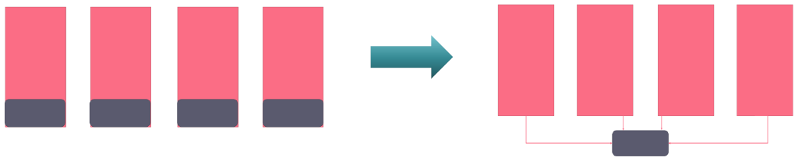

**Kann Abhängigkeiten einführen**

### YAGNI = You Aren´t Gonna Need It

Unnötiges weglassen => Erst implementieren wenn benötigt

### KISS = Keep It Simple And Stupid

=> höhere Komplexität:
 - verringert Wartbarkeit
 - behindert Wiederverwendbarkeit
 - erhöht Anzahl Fehlern 
---
# Design Prinzipien

## SOLID

## S = Single Responsibility

### SRP: Single Responsibility Principle
- Klasse/Funktion nur eine Funktionalität
=> Vermeidung von Seiteneffekten

<div style="display: flex; justify-content: space-around;">
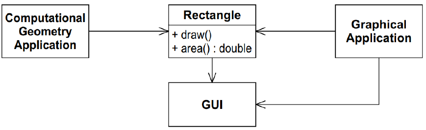
<div width=40><p>=></div>
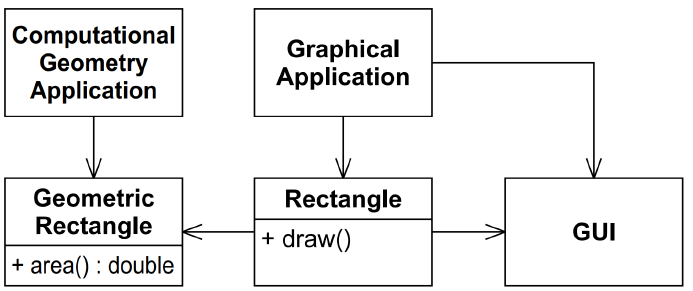
</div>

## O = Open-Closed

### OCP = Open Closed Principle

- open = erweiterbarkeit
- closed = keine Veärnderungen am bestehenden Quellcode notwendig (bei erweiterung)
=> Vermeidung von Seiteneffekten

<div style="display: flex; justify-content: space-around;"> 
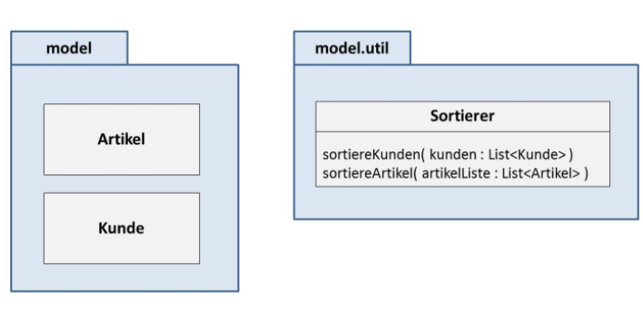
<div width=10><p>=></p></div>
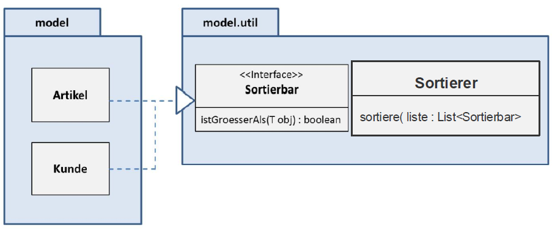
</div>

Wird erreicht durch:
- Unterteilung in Komponenten
- Komponenten in Abhängigkeitshierarchie
- Komponenten niedrigerer Ebenen durch Änderungen von Komponenten höherer Hierarchien schützen


## L = Liskovsches Substitutionsprinzip

### Liskovsches Substitutionsprinzip
- "Leitlinie für Vererbung"
- Unterklassen müssen Oberklassen substituieren
> Untergeordnete Klassen können überliegenden vollständig ersetzen

## I = Interface Segregation

### ISP = Interface Segregation Principle
Keine abhängigkeit von nicht verwendeten Interfaces

**Unnötige Interfaceverkettungen oder große/riesige Interfaces vermeiden!**

Lösung = kleine Interfaces (verkörpern nur eine Eigenschaft) 

## D = Dependency Inversion

### DIP = Dependency Inversion Principle

Keine abhänhigkeit von modulen niedriger Ebene.

=> "High-Level"(Layer) sollen nicht von "Low-Level"(konkrete Implementierungen) abhängig sein

> Abhängigkeiten von stabilem konkreten Code sind erlaubt.

## API-Design
Benutzbarkeit = Leicht verständlich + erlernbar
Effizienz = geringe Übertragung von Datenvolumen
Zuverlässigkeit = Fehlerbehandlung

**Wichtig:**
- Konsistenz = Durchgängige Namensgebung
- Verständlichkeit = Konventionen
    - Getter und Setter bennennen (getId(), setId(int id))
- schwer falsch zu benutzen
- Leaking References vermeiden
    - keine Referenzen zurückgeben (modifizierbare Interna)
- Keine null Rückgaben!
    - eigenen Typ/Fehler zurückgeben statt null

## Fazit von Design Prinzipien
führt nicht automatisch zu besserer Software: "es kommt darauf an!"

# Softwarearchitekturen styles / Pattern

## Qualitätsattribute
Software-Bewertung nach Qualitätsattributen (*itility)

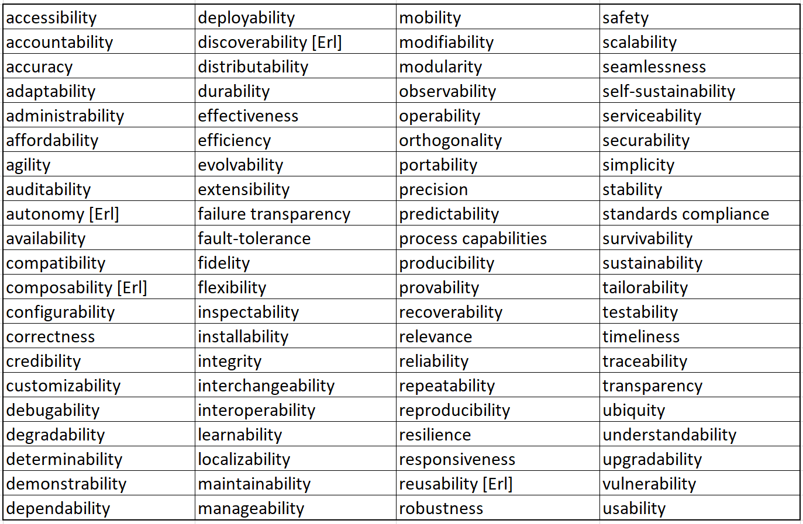


## Monolith versus Verteilt

Verteilte System zeichnen sich aus durch
- Gute Performance
- Gute Skalierungsmöglichkeiten
- Hohe Verfügbarkeit


## Monolithische Architekturen

### Schichtenarchitektur

Fachlichkeit wird nicht beachtet

Trennung nach Technischen Eigenschaften

gut für:
- Kleine Anwendungen
- Web Anwendungen
- Startpunkt für technische "Proof of Concepts"

Aufteilung:

- Graphische Präsentation (Benutzeroberfläche)
- Benutzungsinterface (Interaktionssteuerung)
- Datenverarbeitung (Business-Logic)
- DBMS = Datenbankmanagementsystem
    - Datenmanagement
    - Daten

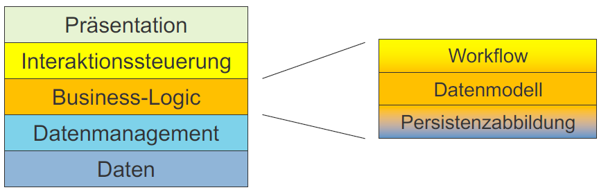

> Verstecken von Komplexität (zugriff nur eine Schicht runter)


### Pipe & Filter - Architektur

Fließband zur Datenverarbeitung

Besteht aus:

- Pipes = Kommunikationskanäle
- Filter = Verarbeitungsprozesse

Bsp. Compiler

Producer = Datenquelle
Transformer = Empfängt Daten, verarbeitet sie und sendet sie Weiter
Consumeer = Endverarbeitung

Ist Datengetrieben 
Bsp. Kafka mit Filtern

### Microkernel

Core System mit Plug-In Componenten

Beispiele: IDEs, Browser, FireFox, Chrome, etc.

## Verteilte Architekturen

Zusmmenschluss unabhängiger Computer
- keinen gemeinsamen Speicher
- kommunizieren mit Nachrichten

### Service Based Architektur

Microservices mit zentraler Datenbank

Varianten bezüglich des User-Interfaces
- Single Monolithic User Interface
- Domain-Based User Interface
- Service-Based User Interface

Es gibt auch Mischformen
Wenn ein Service bsp. exklusiv Daten verwendet, kann dieser eine eigene DB verwenden

Services können technisch oder anhand der Fachdomäne geschnitten werden

Passt gut zum DDD
Simples Transaktiondesign durch ACID-Eigenschaft der zentralen DB

### Event-Driven Architektur

Orchestrator oder Choreographie

Wird Typischerweise mit REST gemacht (Request Based Model)

Mediator Topologie = Orchestrator

### Space-based Architektur 

Mehrere parallele Prozessoren kommunizieren über einen gemeinsamen Speichert

Beispiel (Ticketverkauf bei Tylor Swift, Auktionshaus)

Client stellt Request an Middleware

### Orchestrierte Serviceorientierte Architektur

WDSL, SOAP wurden hier verwendet

BPMN Prozesse

Konzentriert sich auf Wiederverwendung auf Unternehmensebene

Message Flow


### Microservice Architektur

Treibende Philosophie = Bounded Context

Jeder Service modelliert Domäne oder Workflow

Side-Car-Pattern

Mesh-Frontend = Frontend was aus Bauteilen verschiedener Services bestehen

Auch hier wieder Choreographie und Orchestrierung wichtig!

Häufig SAGAs als Transaktionsmodell (Bei Orchestrierung)

### Monolitische Systeme


#### Standalone-Systeme = Alles auf einem Rechner

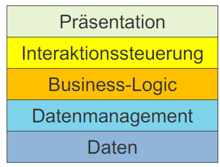

#### Komplette Anwendung läuft zentral auf einem Server

Interaktive Benutzung über Terminals

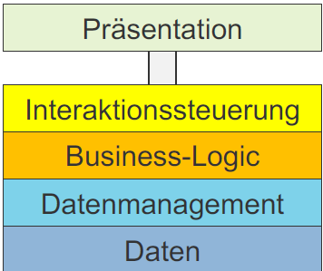

### Client/Server-Systeme

Leistungsfähige PCs ermöglichen Ausführung auf Nutzerrechnern
- Bsp. Fileserver, Datenbank-Server, Workflow-Engines

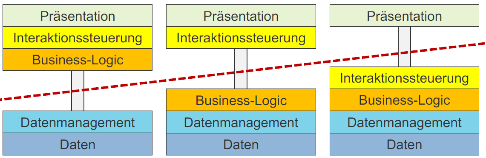

1. Logik auf Client
2. Logik in der Datenbank (Stored Procedures)
3. Logik und Anwendungssteuerung innerhalb des DBMS

### Klassische Two-Tier Architektur

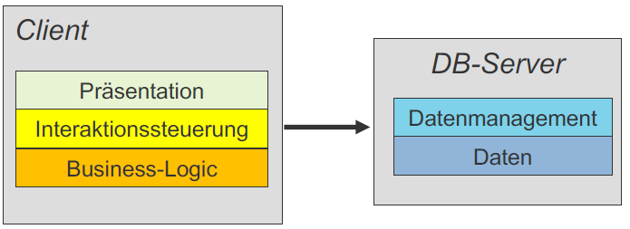

Vorteile
- Einfaches Programmiermodell
- Applikationslogik liegt hauptsächlich auf dem Client

Nachteile
- Hohe Anforderungen an die Client-Rechner (hohe Kosten)
- Nicht unbegrenzt skalierbar
- Softwareverteilungsproblem: Client-Versionen müssen synchron sein

### Verteilte-Anwendungen / Three-Tier / n-Tier Architekturen

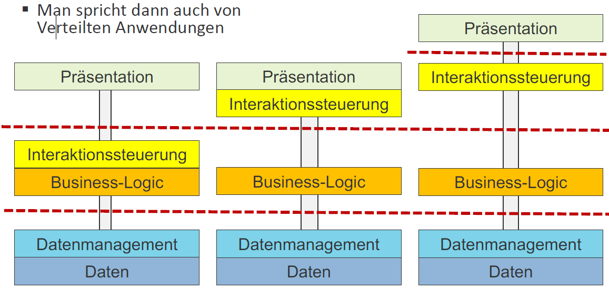

Verteilung des Programms auf diverse Rechner
kann erfolgen:
 - Vertikal (Schichten auf unterschiedlichen Rechnern)
 - Horizontal (Anzahl der Schichte)
 - in beiden Dimensionen

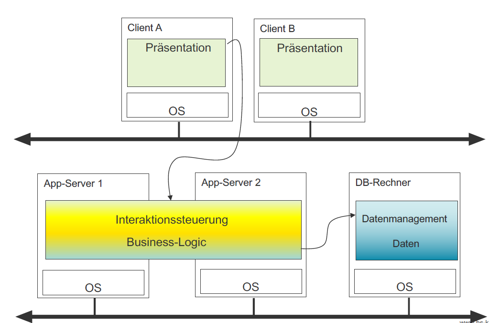

Aufteilung in:
 - DB
 - Logik(Backend) 
 - Presentation(Frontend)

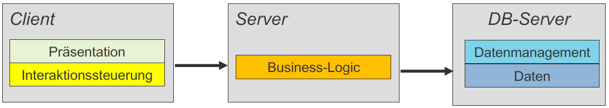 


### Middelware

liegt zwischen OS der Rechner (Rechner A, B, C) und verteilter Anwendung 
bietet Middleware-Services z.B.:

- Namensdienst
- Kommunikationsdienst
- Filedienst
- Zeitdienst
- Konkurrenzdienst
- Transaktionsdienst
- Sicherheitsdienst

bieten Standardfunktionen (vereinfacht verteilter Anwendungen)

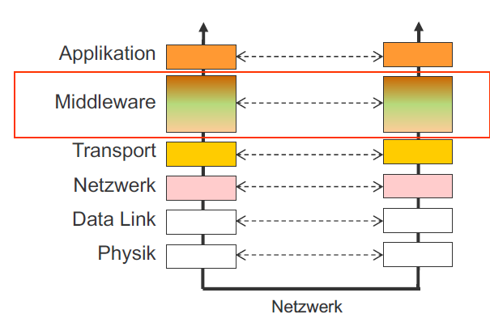

### Kommunikationsarten
<table>
<th>Synchron</th>
<th>Asynchron</th>
<tr>
<td>http, REST</td>
<td>fetch(JavaScript), JMS(Messaging)</td>
</tr>
</table>


<table>
<th>One-to-One</th>
<th>One-to-Many</th>
<tr>
<td>http, Rest, fetch, JMS mit Queues</td>
<td>Eventauslieferung beim Observer, JMS mit Topics</td>
</tr>
</table>

#### Synchrone Kommunikation

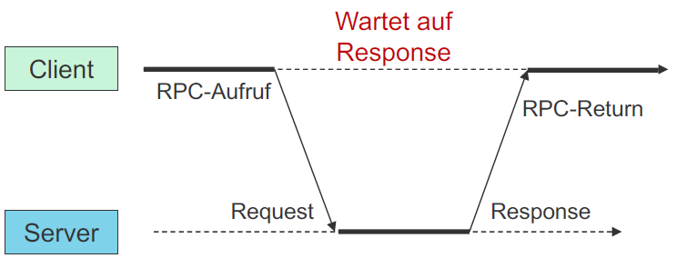

#### Asynchrone Kommunikation 

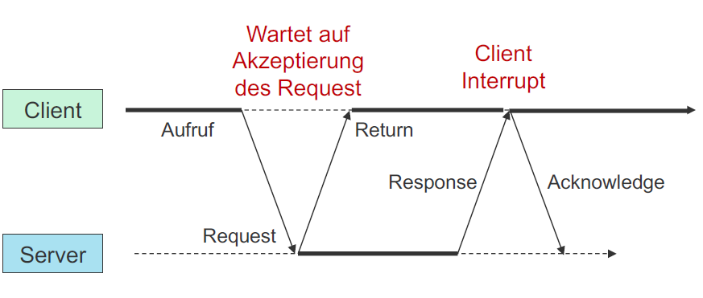


#### Kommunikationsfehler

- Request verloren/verzögert
- Response verloren/verzögert
- Client/Server nicht verfügbar

> Resend?, Timeout? etc.


---


# Design-Pattern
## Eigenschaften
- basieren auf realen Designs
- zeigen tiefergehende Strukturen und Mechanismen eines Systems
## Implementierung
>abstrakter Lösungsentwurf
<!--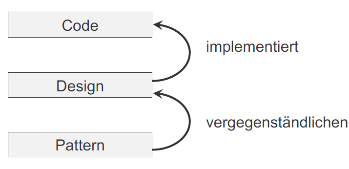-->


---

## Creational Patterns 
Erzeugung von Objekten => Entkoppelt Konstruktion eines Objekts von Repräsentation

### Factory Pattern
Erzeugungsmethode (gibt Objekt des gewünschten Typs zurück)

### Abstract Factory Pattern
abstract Factories ermitteln Erzeugungskontext automatisch

Interface stellt Objekt erzeugungs Methode bereit. Erbende Klassen Implementieren diese (und erzeugen in Methode Objekt)
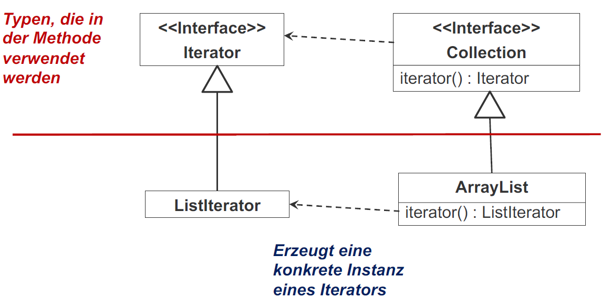

#### Beispiel zwei überlappende Factories


### Builder Pattern

trennt Konstruktion (eines Objektes) von Repräsentation.

> **Problem**: Konstruktorparameter müssen im Konstruktor klar definiert sein!
```java
class A{
    A(int a, b){}
    A(int b, c){} //Fehler
    A(int a, c){} //Fehler
}
```
>Parameter könnten per Setter Methoden gesetzt werden -> große Fehlerquelle (Initialisierung über mehrere Zeilen)

Lösung durch erzeugung interne Builderklasse. Enhält für jeden Parameter äquivalent und wird an Konstruktor übergeben. 

```java
Class A{
    private int a;
    private int b;
    private int c;
    A(ABuilder builder){
        this.a = builder.a;
        this.b = builder.b;
        this.c = builder.c;
    }
    class ABuilder{
        int a = 0;
        int b = 0;
        int c = 0;
        public ABuilder setA(int a){
            this.a = a;
            return this;
        }
        public ABuilder setB(int b){
            this.b = b;
            return this;
        }
        public ABuilder setC(int c){
            this.c = c;
            return this;
        }
        Public A build(){
            return new A(this);
        }
    }
}
```
Aufruf:
```java
A a = new A.ABuilder().setA(1).setB(2).setC(3).build();
```

### Singleton
höchstens ein Objekt der Klasse darf existieren
>> singleton ist Global Accessible => **Das Singleton ist keine globale Variable!**

**Lazy Implementierung**
>**nicht** thread-safe!
```java
public class Singleton {
    private static Singleton instance;
    private Singleton() { }
    public static Singleton getInstance()
    {
        if( instance == null )
        {
            instance = new Singleton();
        }
        return instance;
    }
}
```
**Eager Implementierung**
>thread-safe
>> Instanziierung an laden der Klasse gebunden
```java
public class Singleton
{
    private static Singleton instance = new Singleton();
    private Singleton() { }
    public static Singleton getInstance()
    {
        return instance;
    }
}
```
**Implementierung mit Holder-Klasse**
>**Java only**

Erzeugung des Singletons an laden der internen Klasse gebunden
```java
public class HolderSingleton
    {
    public static class Holder
    {
    private static HolderSingleton instance = new HolderSingleton();
    }
    public static HolderSingleton getInstance()
    {
        return Holder.instance;
    }
    private HolderSingleton() { }
}
```
### Prototype Pattern
**Copy & Paste & Modify**

## Structural Patterns

vorgefertigte Schablonen (Beziehungen zwischen Klassen)

### Adapter Pattern
zwei Versionen(Objekt-Adapter / Klassen-Adapter)

>Lollypop Schnittstelle -o )-
> **Kompatibilität zwischen Schnittstellen => Keine neue Funktionalität => Nur eine Delegation**
#### Objekt-Adapter
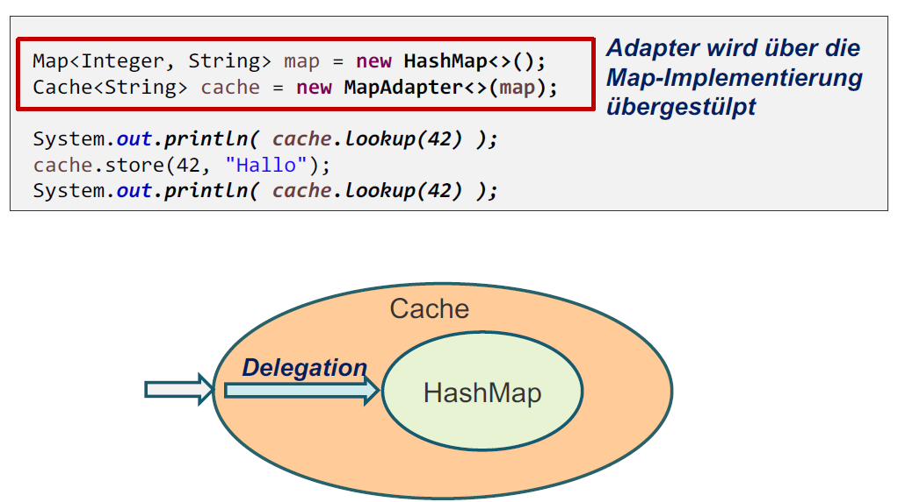

#### Klassen-Adapter
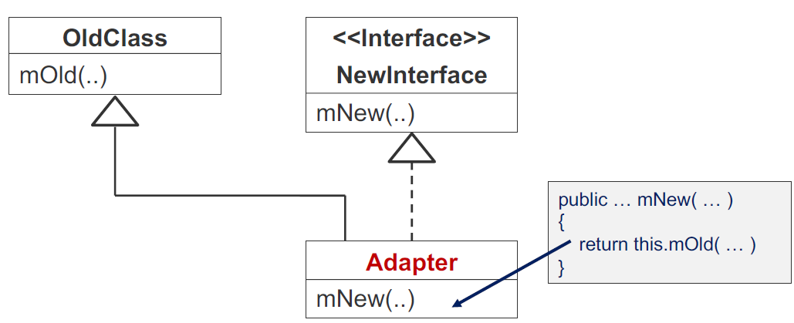

### Decorator

>*"funktionale objekterweiterung => Funktionalität hinzufügen (gleicher typ)"*

Unterschied Wrapper: Wrapper fügt (in Java) keine Funktionalität hinzu
Wrapper = Typkonvertierung 

Erweitert Objekt um Funktionalitäten => vgl: Pizzabelag

Problem: **Großer Vererbungszweig/Vererbungsbäume**

Organisierung in Ketten

(Dekorator 1) -> (Dekorator 2) -> (Dekorator 3) -> (Konkretes Objekt)

> Wichtig: **Austauschbarkeit**

Kein Referenzvergleich == mehr möglich (Equals und Hash überschreiben)

Erzeugung meist durch Factories

Dekorator verdeckt Objekt-ID

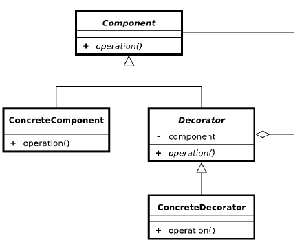

### Proxy

Stellvertreter Objekt

Remote Proxy: Bsp. Remote Zugriff auf ein Objekt 

>**Nicht Read-Only** Per Set Methode können Daten bearbeitet werden
>> **nur** stellvertretenden Zugriff auf Fremdes Objekt

>(alt)RMI / (neu)REST

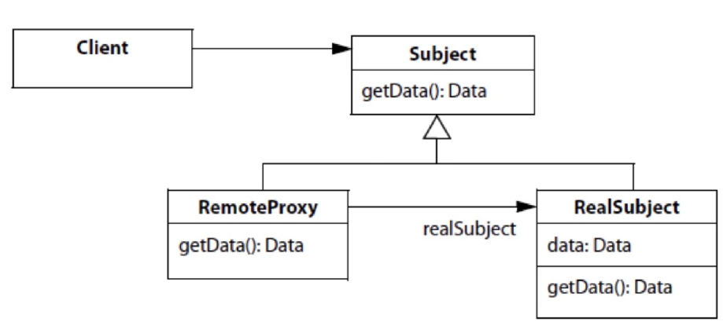

### Adapter vs. Decorator vs. Proxy

Adapter = Überbrückung zweier Schnittstellen
Decorator = Erweitert Funktionalität des ursprünglichen Objekts
Proxy = Besitzt selbe Schnittstelle und zeigt selbes Verhalten


### Bridge Pattern
>*"Vgl golden gate Brigde: verbindung zweier Landzungen" => "Adapter für Klassenhierarchien"*

Verbindet größere Schnittstellen

>*"Vgl: Treiber (JPA oder JDBC) Großer Adapter zwischen Abstraktion und Implementierung"*
>>*"Schnittstelle mit großer Hierarchie wird adaptiert"*

<div style="display: flex; justify-content: space-around;">
    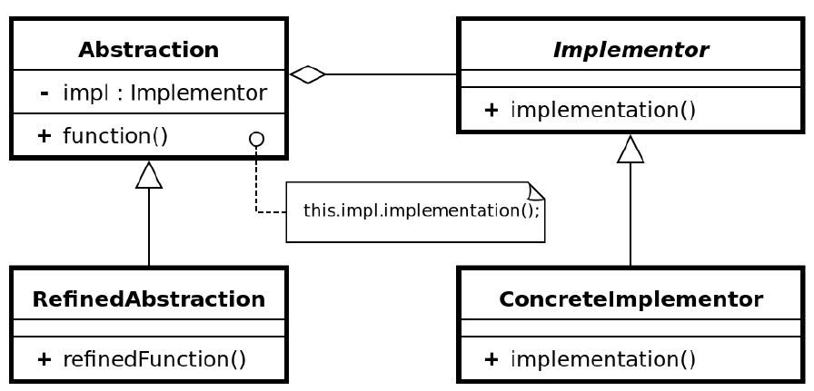
    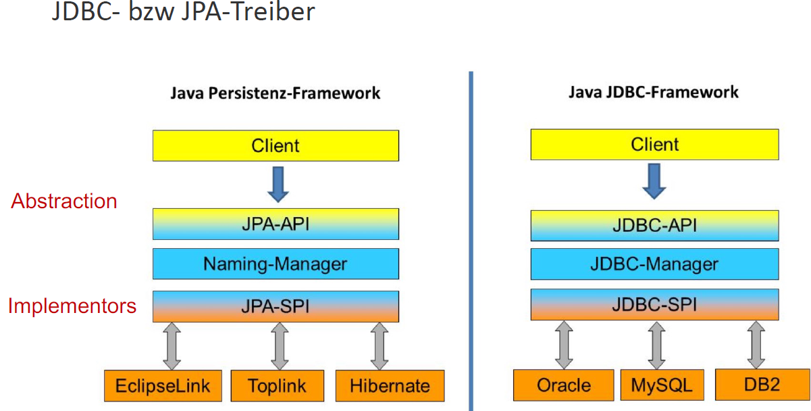
</div>

### Facade / Fassade

Verbirgt Komplizierte Klassenkonstrukte => Schnittstelle

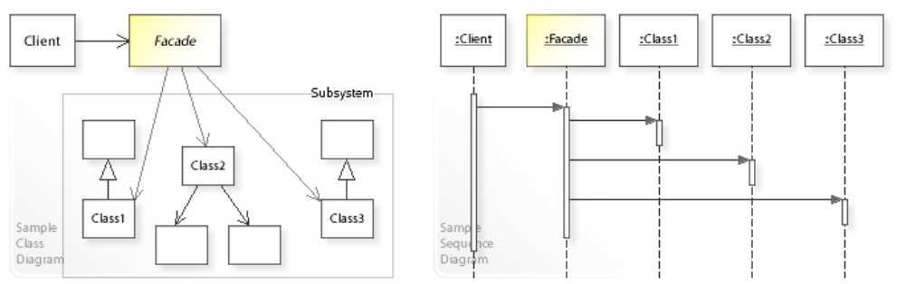

#### Vorteile

Vereinfacht:
- komplexes Domain Model

- Austausch von Implementierungen

#### Nachteile
- Mutieren oft zu Monsterklassen
- Keine Isolierung des Sub-Systems => Soll idR. Zugriffe auf dahinterliegende Objekte zulassen und erleichtern
> Einfache Zugriffsschnittstelle für komplexere Aufrufe

### Composit 

hierarschicher Aufbau einer Datenstruktur

**Einsatzzweck:**
- Aufbau flexibler hierarchischer Struktur
- Bestandteile können einheitlich behandelt werden

> **Bsp. Baum-Datenstruktur, Dateisystem**


## Behavioral Patterns

Modellieren komplexes Verhalten (erhöht Flexibilität)

- Replacement Principle
- erhöhte komplexität

**so einfach wie möglich so komplex wie nötig!**

### Command

Arbeitsanweisungen als Objekt 

>**IntUnaryOperator** = Damit können Lambdaausdrücke genutzt werden 
```Java
public static void main(String[] args)
{
    System.out.println("Summe " + sum(0,10, i -> i) );
    System.out.println("Summe Quadratzahlen " + sum(0,10, i -> i*i) );
}
private static int sum(int start, int end, IntUnaryOperator function)
{
    int sum = 0;
    for(int i=start; i < end; i++)
    {
        sum += function.applyAsInt(i);
    }
    return sum;
}
```

#### Erweiterungen
#### Command Stack

Bsp. Undo

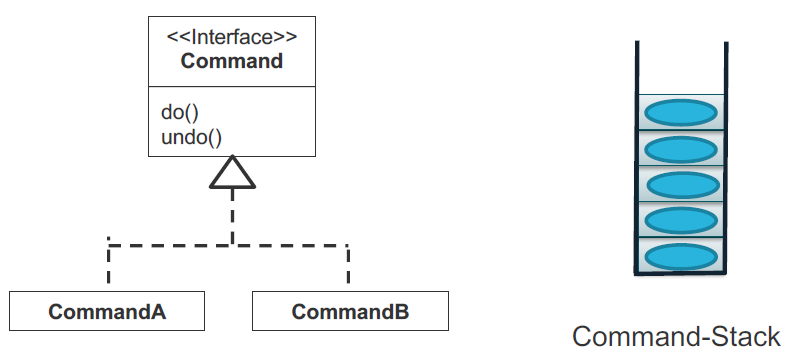

#### Command-Broker

übergibt passenden Commandhandler die Aufgabe (evtl übernimmt Commandbroker Aufgabe selbst)

Executoren entsprechen Execution-Brokers 
=> z.B. Executor Service

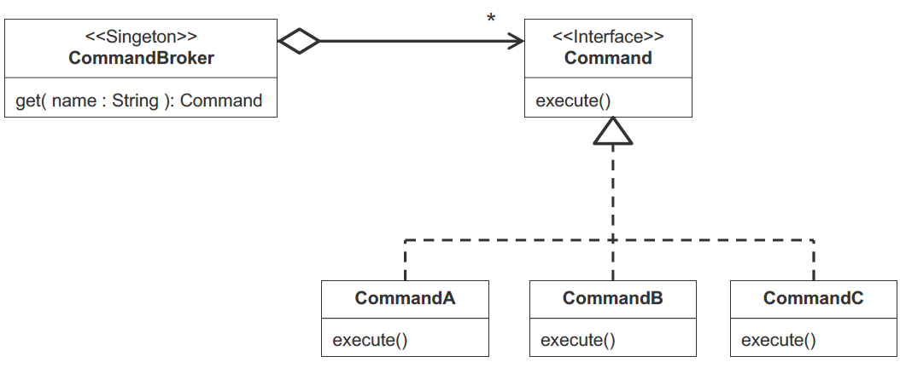

### State Pattern

Wechseln von Zuständen bei Input

#### Prozedurale implementierungsvariante 
> Aktueller Zustand => Ereignis => Bedingung/Folgezustand
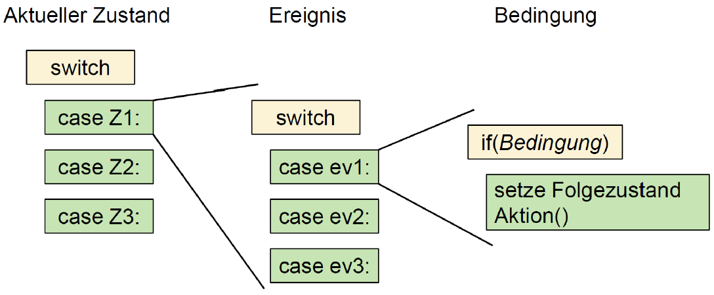

Vorteil = Ablauforientiert
```Java
while (index < eventSequenz.length()) {
    char event = eventSequenz.charAt(index);
    switch (state) {
        case "Q1":
            switch (event) {
                case 'a': state = "Q2"; break;
                case 'b': state = "Q1"; break;
                default: System.err.println("Falsches Event");
            }
        break;
        case "Q2":
            …..
        case "Q3":
            …..
        default: System.err.println("Falscher Zustand");
    }
```
Nachteil: Zeitaufwendig (anpassung von allen switches bei neuem Zustand)

#### Implementierungsart mit Zustandsklassen

> Implementierungsvariante als Graph
>> Knoten und Kanten => Zustand hat mehrere Knoten für jedes Event
>>> - Knoten = Zustandsübergänge
>>> - Kanten = Zustände
>> - nachbau der Struktur nach: State A hat Übergang zu B, C, D
>> - Bsp Web oder Webframework

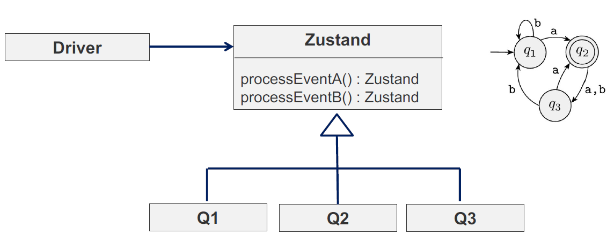

```Java
public class Q1 extends Zustand
{
    @Override
    public Zustand processEventA() { return new Q2(); }
    @Override
    public Zustand processEventB() { return this; }
}
public static void main(String[] args)
{
    Zustand state = new Q1();
    state = state.processEventA().processEventB().processEventA();
    System.out.println( state.getClass().getSimpleName() );
}
```

#### Graph Implementierung


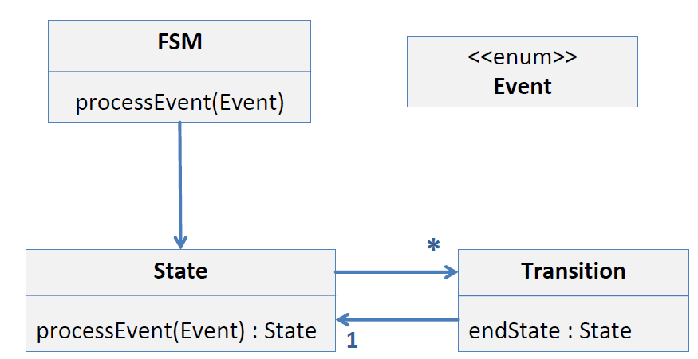

Parameter konfigurieration von außen
> Grundlagen zuerst: Transitionsmodelle, etc.

### Template Method

abstrakte Klasse Figur deklariert Methode um Figur zu zeichnen. alle erbende Klassen implementieren draw-Methode

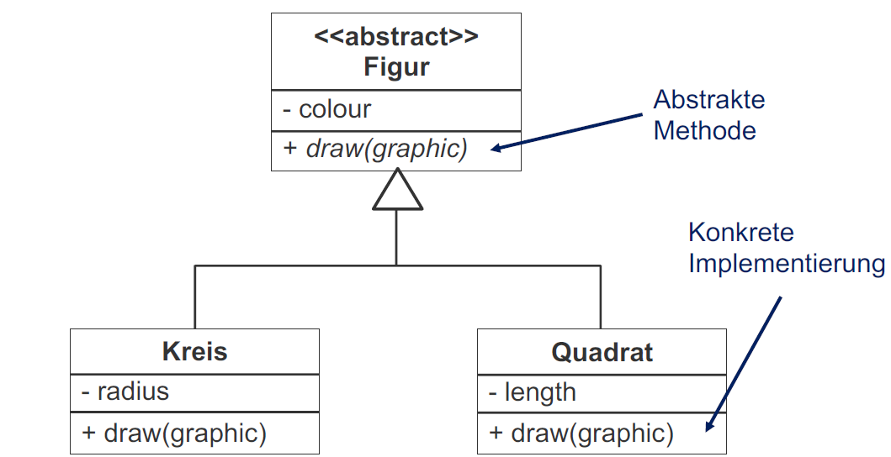

#### Problem 1: konkrete Implementierung von draw() benötigt Zugriff auf Farbwert

#### Lösung 1: Implementierung eines Farbattributes


Nachteil: prepare-Aufruf kann werden vergessen => **erhöhte Komplexität**

#### Beispiel: Implementierung einer getColor() Methode


### Strategy

Erlaubt Austausch/Konfiguration zur Laufzeit.

*"Wenn sie etwas sortieren wollen können sie den Sortieralgorithmus austauschen"*

Beispiele:
1. Comparator
2. Baum-Beispiel: iteriertion ("Traversierung") wird anhand Strategie festgelegt 

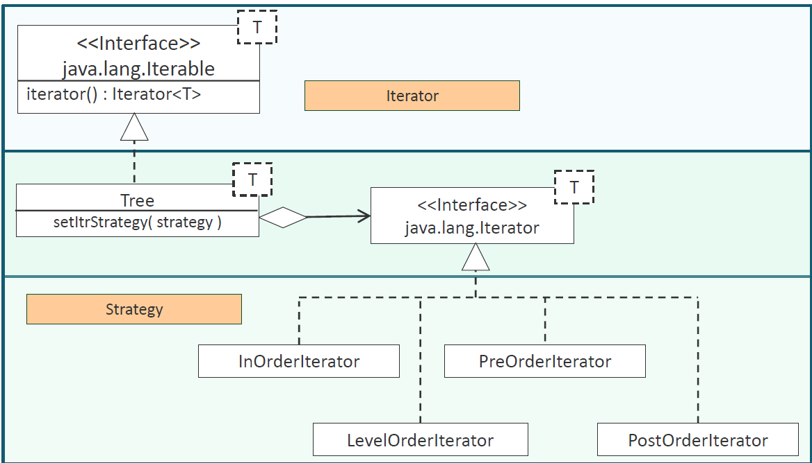

### Observer
Vgl Callback (events)

Umsetzung unterscheidung in drei Arten:

- Push Notification
    - WasUpdated (no Payload)
- Push Update
    - Push Update (with Payload)
- Pull Notification
    - Update Request (von Ovserver)

> **"MCV Pattern ist Observer => View ist Observer von Model"**

---


---
# Webservices
- XML Standards
- Textbasiert ("Jede Programmiersprache kann Text")

## Web Service Dreieck

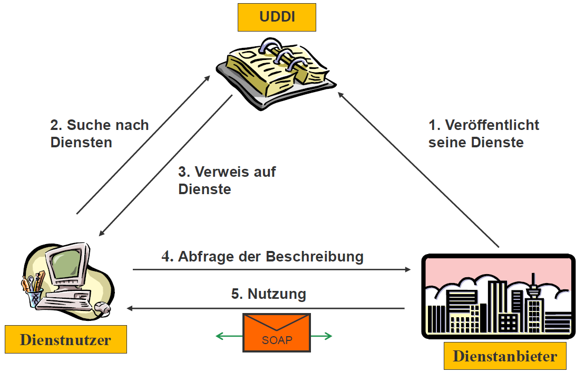

> UDDI = Universal Description, Discovery, and Integration => Naming Service

## SOAP = Simple Opject API (SOAP)
legt fest, wie Nachrichten aufgebaut sein müssen
SOAP = Kommunikationsprotokoll (textbasiert)

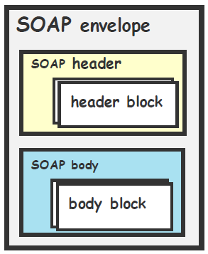

## WSDL = Web Service Definition Language
XML-Vokabular zur Beschreibung von Schnittstellen

WSDL beschreibt:
- bereitgestellte Funktionen
- Datentypen der Nachrichten (Request und Response)
- Für Protokoll relevante Informationen
- Adressen unter denen Dienste erreichbar sind


## Arten des Nachrichtenaustauschs

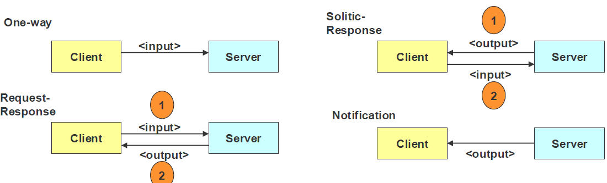


---
# REST (Representational State Transfer)

Wird oft mit Spring realisiert.

## Motivation für REST
Motivation = viele Programme innerhalb einer Firma
"einheitliches" Kommunikationsprotokoll weitreichende Unterstützung

**schreibt kein Protokoll vor, wird aber i.d.R mit HTTP verwendet**

## Fünf Prinzipien von REST
1. Ressourcen besitzen eindeutige ID (adressable ressources)
    - RESTful HTTP = URLs
2. unterschiedliche Ressourcen Repräsentationen
    - RESTful HTTP = JSON oder XML
3. Standartisierte Methoden
    - RESTful HTTP = GET, POST, PUT, DELETE
4. Stateless Kommunikation
    - HTTP ist zustandslos
5. Hypermediaverwendung
    - Hypermedia As The Engine Of Application State (HATEOAS)
    - Ressourcenverknüpfung über Links

## Architekturprinzip: Adressierbarkeit

Adressierung über URI

=> Adressierung über HTTP
http://example.com/kunde?name=Harry&plz=66482


## Repräsentationen

```{json}
{
    'name' : 'Albert'
    'id' : '42'
}
```
> Repräsentation (Person) durch ID und Name

### Repräsentationsanforderung

```
GET products/143 HTTP/1.1
Host: www.example.com
Accept: application/xml, application/json => akzeptierte Repräsentationsform
```

## Standartisierte Methoden

**GET, PUT, DELETE sind idempotent**
**Nur POST ist nicht idempotent**

Idempotent => Hat einmal eine Wirkung, beim zweiten mal jedoch keine
> Beispiel |-3| = 3 => ||-3|| = 3 => zweite Betrag hat keine Wirkung

Als Daumenregel gilt für CRUD(Create, Read, Update, Delete)
<table>
    <th>Aktion auf der Ressource</th>
    <th>HTTP-Methode</th>
    <th>RPC-Style Schnittstelle</th>
    <td>RESTful HTTP</th>
    <tr>
        <td>CREATE</td>
        <td>POST</td>
        <td>addBook()</td>
        <td>POST /books</td>
    </tr>
    <tr>
        <td>READ</td>
        <td>GET</td>
        <td>getBooks()</td>
        <td>GET /books</td>
    </tr>
    <tr>
        <td></td>
        <td></td>
        <td>getAuthorsFromBook()</td>
        <td>GET /books/{id}/authors</td>
    </tr>
    <tr>
        <td>UPDATE</td>
        <td>PUT bzw. PATCh</td>
        <td>updateBook()</td>
        <td>PUT /books/{id}</td>
    </tr>
    <tr>
        <td>DELETE</td>
        <td>DELETE</td>
        <td>deleteBook()</td>
        <td>DELETE /books/id{id}</td>
    </tr>
</table>


## Richardson Maturity Model

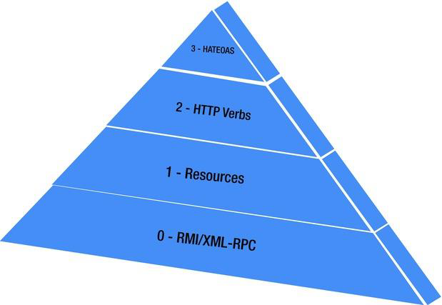

## Hypermedia 
Hypermedia = Hypertext + Multimedia
Links zur Verknüpfung verschiedener Medien


---
# Single-sign on/Keycloak

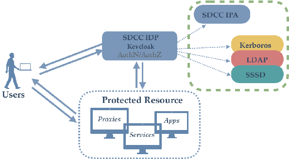
---
# Verteilte Transaktionen (Trasaktionsprotokoll/CAP-Theorem)

Transaktionen über mehrere transaktionale Systeme

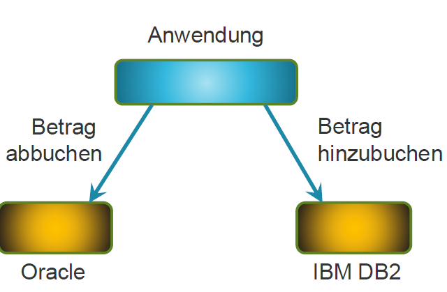

## ACID

- A–Atomar
    - ausführung komplette oder gar nicht (commit oder abort)
- C–Konsistent
    - Transaktion überführt konsistenten Zustand in anderen konsistenten Zustand
- I–Isoliert
    - Seiteneffektfrei (kann Nebenläufig ausgeführt werden)
- D–Dauerhaft
    - Änderungen nach Transaktion dauerhaft gespeichert
    - muss auch nach Systemfehler garantiert sein

ACID kann nur von relationalen Datenbanken garantiert werden. NoSQL-Datenbanken garantieren nicht alle ACID-Funktionalitäten. NoSQL nutzt häufig BASE.

## Transaktionsmanager


### Ablauf


<table>
<tr>
<td>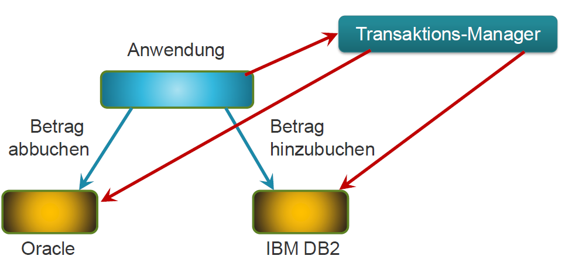</td>
<td>beteiligten Systeme geben Autonomie auf</td>
</tr>
<tr>
<td>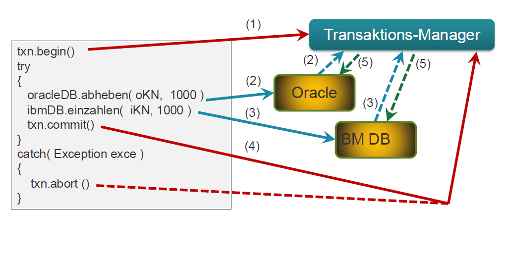</td>
<td>
1.      Anwendung eröffnet Transaktion => Erhält Transaktions-ID<br>
2-3.    Beteiligte Ressourcen registrieren sich bei Transaktionsmanager unter der Transaktions-ID<br>
4.      Anwendung beendet (commit oder abort) die Transaktion mit Transaktions-ID<br>
5.      Transaktionsmanager führt Commit-Protokoll mit den an Transaktions beteiligten Ressourcen durch.
</td></tr></table>

## 2-Phasen Commit Protokoll

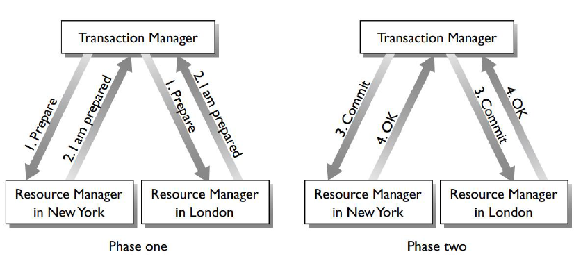


## X/Open-Transaktionsmodell


- Anwendungsprogramm initiiert Transaktionen über TX Interface.
- Transaktionsmanager koordiniert Transaktionen
- Die Resource Manager führen Operationen (Lesen, Schreiben) aus
## BASE

- BA = Basically Available 
    - Stellt garantiert allen Benutzern Abfragen zur Verfügung => Keine Konsistenz garantiert
- S = Soft State 
    - States können sich über äußere Einflüsse andern
- E = Eventually Consistent 
    - Zustand des Systems wird schrittweise über alle Knoten repliziert.
        - System wird nach und nach konsistent

Beispiel der Microservice Architektur => Nicht mit 2-Phasen-Transaktion umsetzbar => Funktioniert einfach nicht

## SAGA - Transaktionsmodell


Sequenz von Transaktionen, welche Dinge aktualisieren 
Jede Änderungsoperation die ich habe muss eine Rückgängigkeitsmöglichkeit haben
>=> Aufteilung einer verteilten Transaktion in lokale Transaktionen.


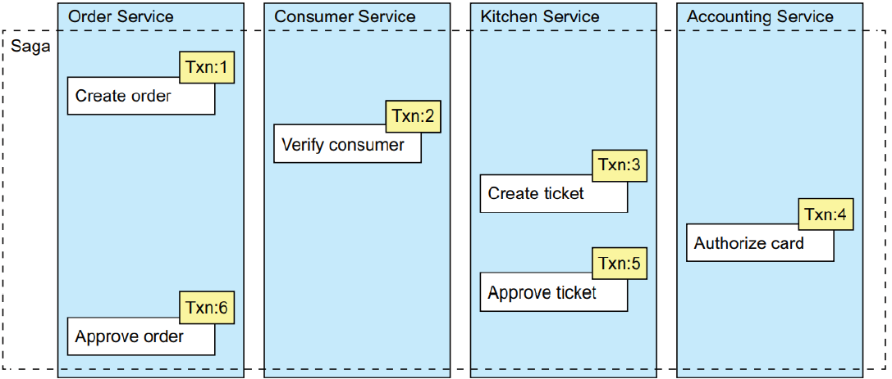

### Pattern: Orchestrierung

Merkhilfe => Orchester mit Dirigent => Ohne Dirigent kann Orchester nicht spielen

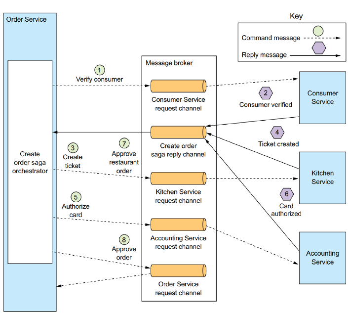

Nachteile:
- System abhängig von "Dirigent"
- "Dirigent" = "Flaschenhals"

### Pattern: Choreographie

Merkhilfe => Balett => Jeder weiß was er zu tun hat (abschauen ob bei Nachbar alles klappt)

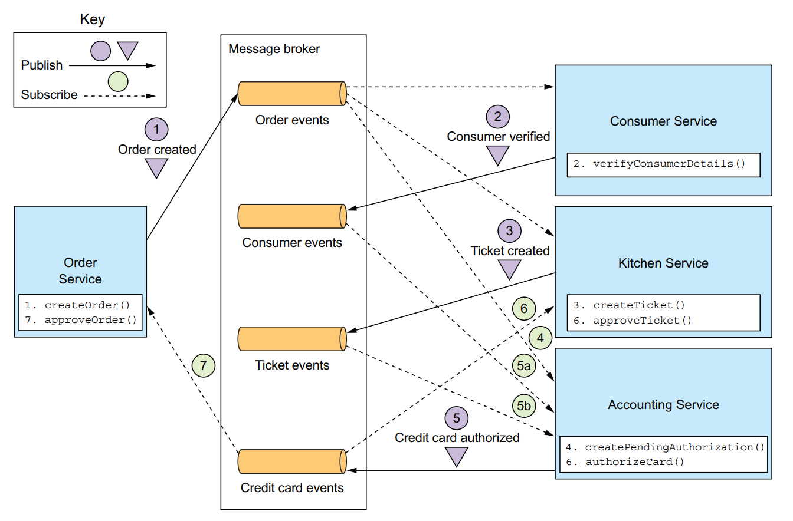


## CAP-Theorem

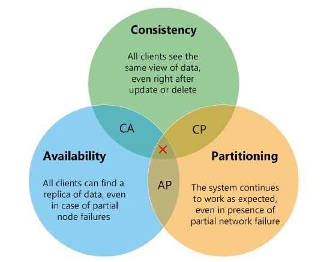

- C - Consistency (Konsistenz)
- A - Availability (Verfügbarkeit)
    - jederzeit Lese- und Schreibzugriffe
- P - Partition Tolerance (Ausfalltoleranz)
    - System kann trotz Ausfalls einzelner Knoten weiterarbeiten

> **immer nur 2 möglich (CA, CP, AP)**


# Was ist Kafka? MISSING!!!!!!!!!!!!!!!!!!!!!!!!!!!!!!!!!!!
---
# Domain Driven Design (DDD)


▪ Vorgehensweise zur Modellierung komplexer Software
▪ Softwarelösungen im Einklang mit Fachdomänen 
▪ Verwendung einheitlicher Sprache (ubiquitous language)

## Ablauf Softwareentwicklung

> Erst wenn die Anforderungen genau definiert sind lohnt es sicht ein Fachmodell zu entwickeln und erst dann sollte die Zielarchitektur geplant werden.

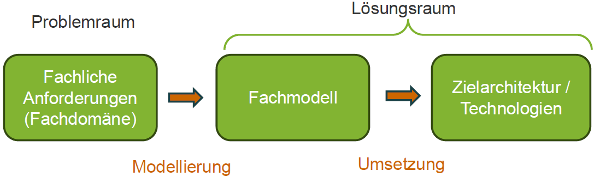


## Arten von Komplexität

1. Essentielle Komplexität
    - Innenwohnende Komplexität der Fachdomäne
2. Akzidentelle Komplexität
    - Ensteht zufällig durch:
        - Misverständnissen bei Analyse
        - Schlechtes Design / schlechte Architektur
        - unpassende/veralteter Technologie
        - Unnötige Features/Lösungen


## Strategisches Design
Definiert Bounded Contexte
> Beschäftigt sich mit Großem ganzen (Kontext Mapping , Zusammenarbeit zwischen Teams)

Aufteilung der Fachdomäne

Context nutzt eigene, der Anwendung entlehnte Sprache (**Ubiquitous Language**)
Begriffe eindeutig und immer gleich: 
 - im Gespräch
 - in den Klassendiagrammen
 - im Sourcecode

### Bounded Context
"geschützter" Raum mit vollständigen Fach- bzw. Prozessmodell und Sprache
=> repräsentiert abgeschlossenes vollständiges System

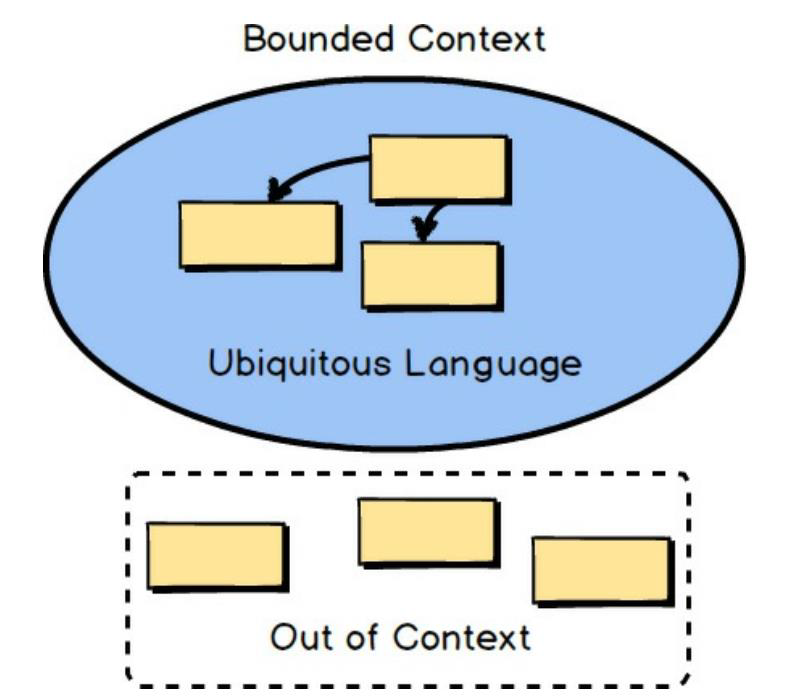

Architekturmodell für einen Bounded Context

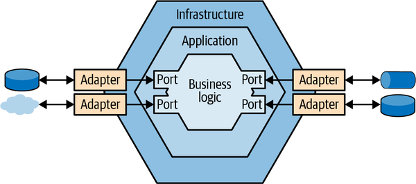

### Context Mapping

Form der Zusammenarbeit zwischen den Teams

## Taktisches Design

Entwurf und Aufbau eines Bounded Contexts

### Aggregats

Aggregates repräsentieren einen "Zusammenhang", besitzen somit auch Mutationsfunktionalität

### Command Query Responsibility Segregation (CQS)
Aufteilung von Lesenden und Schreibenden Zugriffen
Queries = Lesende Zugriffe
- Lesen nur aus der Datenbank
Commands = Schreibende Zugriffe
- Das Command löst ein Event aus, welches die Lesedatenbank (irgendwann) aktualisiert
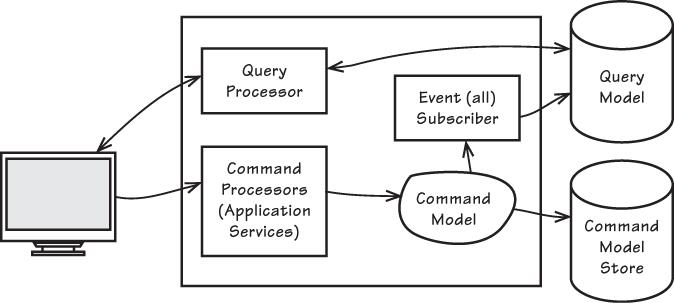

## Collaborative Modeling
 Collaborative Modeling = Anforderungsermittlung, identifiziert Geschäftsprozesse, Rollen und Arbeitsgegenstände im Problemraum
- z.B. Domain Story Telling
---


# Microservices (12-Faktor apps)

### Vorteile

▪ Skalierbarkeit
▪ Geschwindigkeit
▪ Kopplung

### Nachteile

▪ Automatisches Build- und Deployment notwendig
▪ Komplexe Infrastruktur und Runntime (Cloud) notwendig


## The Twelve Factors

Definiert Best Practices für Anwendungen
|Nr|Beschreibung|Definition|
|-----|-----|-----|
|1  |   Codebase                    |   Eine Codebase, viele Deployments
|2  |   Abhängigkeiten              |   explizit deklarieren + isolieren
|3  |   Konfiguration               |   in Umgebungsvariablen ablegen
|4  |   Unterstützende Dienste      |   als angehängte Ressourcen behandeln
|5  |   Build, release, run         |   Build- und Run-Phase strikt trennen
|6  |   Prozesse                    |   Die App als einen oder mehrere Prozesse ausführen
|7  |   Bindung an Ports            |   Dienste durch Binden von Ports exportieren
|8  |   Nebenläufigkeit             |   Mit dem Prozess-Modell skalieren
|9  |   Einweggebrauch              |   Robuster mit schnellem Start und problemlosen Stopp
|10 |   Dev-Prod-Vergleichbarkeit   |   Entwicklung, Staging und Produktion so ähnlich wie möglich
|11 |   Logs                        |   Logs als Strom von Ereignissen behandeln
|12 |   Admin-Prozesse              |   Admin/Management-Aufgaben: einmalige Vorgänge


## API-Gateway

eine Verteiler- / Zentrale Schnittstelle

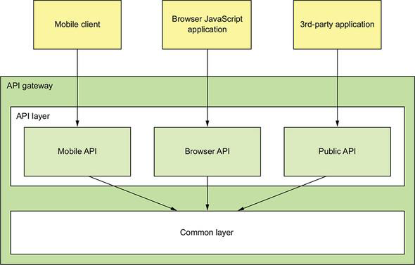

### Single Entry Point Gateway-API

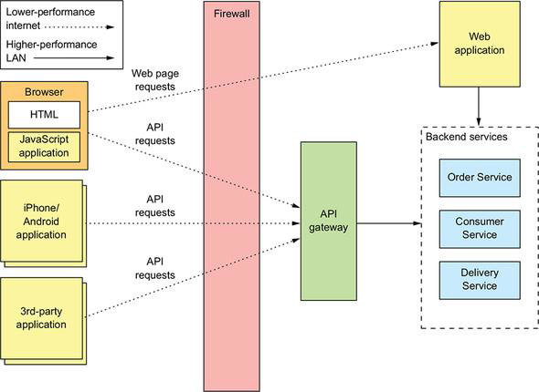

---
# Kubernetes -> versucht gewünschten Zustand herzustellen

Container-Orchestrationssoftware
- Kernkonzepte
    - Container-Engine, kein VM-Tool
    - Deklarative Konfiguration von Ressourcen
    - Erweiterbarkeit durch eigene Schnittstellen
    - Self-Healing: 
        - Anwendung nicht (mehr) bereit? -> neustart (Container wird neu angelegt)
- Eignung für schnelle Prozesse mit häufigen Aktualisierungen
- Anwendungskomponenten werden bei Aktualisierung neu erstellt
    - Aging verhindern
- Konzepte angelehnt an Microservices/ 12-Faktor Apps
- Enterprise Features im Standardumfang
    - Hochverfügbarkeit
    - Skalierbarkeit

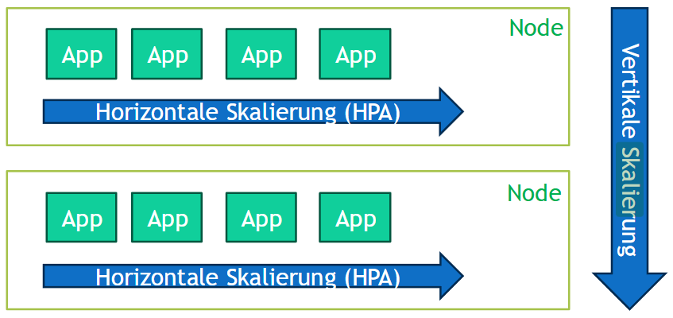

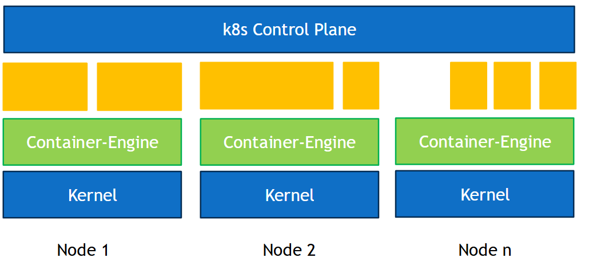

## Vorteile:
- Ermöglicht Reaktion auf Lastereignisse
- Automatische Verteilung von Containern auf Worker-Nodes („Scheduling“)
- Nodes häufig (vom Hoster) provisioniert
    - Einheitliche Basis
    - Einfache Erneuerung, z. B. bei Hardwareschaden

## Begriffe
- Pod:
    - kleinste Einheit in Kubernetes
    - beinhaltet Container (1-n)

- Deployments: 
    - beinhaltet Pods(1-n)
    - Definiert Templates für neue Pods
    - Kapselung mit neuen Features
        - Skalierung
        - Rollout
        - Instanzanzahl (Replicas)   


---


---


# Service Oriented Architekture (SOA)

Strukturierung und Nutzung verteilter Funktionalität
> Anwendungslandschaft aus einzelnen Anwendungen
> - Anwendungen lose gekoppelt (bieten Funktionalitäten durch Services an)

**Idee der SOA = Schnittstellen werden zu standartisierten Services umfunktioniert**
> - benötigt Mechanismen zum Finden und Kommunikation mit Services
> - Middleware orchestriert (ist selbst als Service erreichbar)

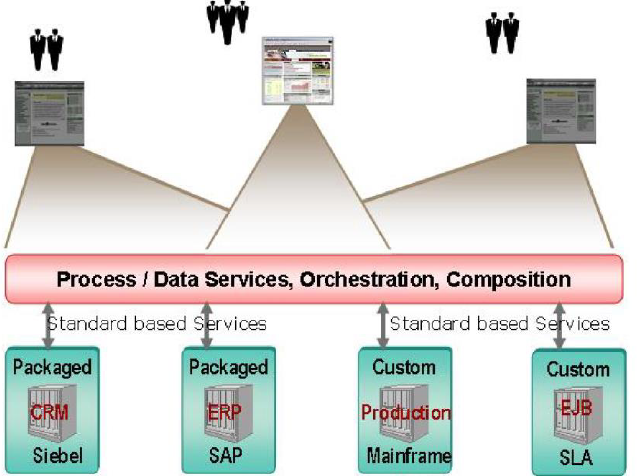


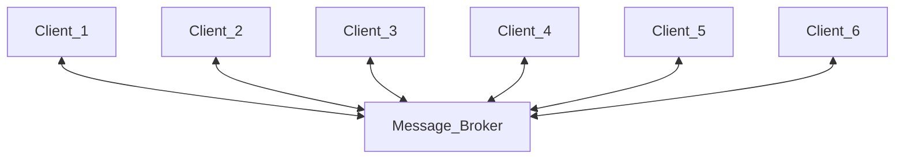
```mermaid
graph TD;
    Client_1 <--> Message_Broker;
    Client_2 <--> Message_Broker;
    Client_3 <--> Message_Broker;
    Client_4 <--> Message_Broker;
    Client_5 <--> Message_Broker;
    Client_6 <--> Message_Broker;
```
- Nachricht = Paket aus Daten und Routing Informationen
- Nachrichtenversand über MOM
>Nachricht an Message Broker = Synchron
>Asynchron durch zeitliche Entkoppelung
>>Kommunikation zwischen Teilelementen = Asynchron


## MOM = Message Orientated Middleware

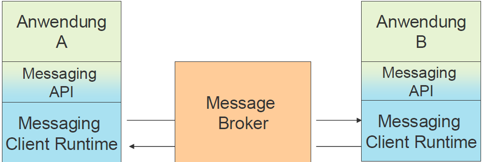

### Messaging Modelle

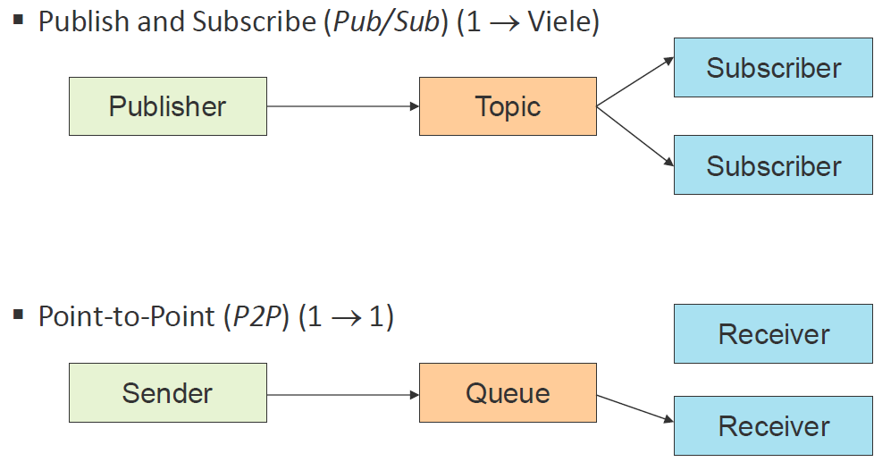

#### Publish Subscribe (Pub/Sub)(1 -> Viele)

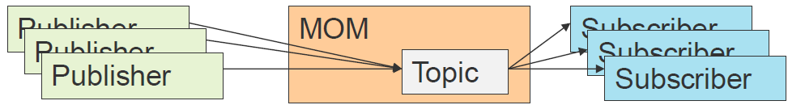

#### Point to Point (P2P) (1->1)

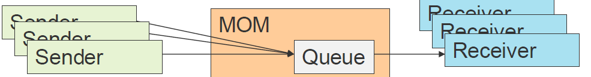

## Broker Varianten

- Internal Broker = direkt innerhalb Anwendung oder Application Servers
- External Broker = eigenständiger externer Service
- Embedded Broker = einbettung in Anwendung


## Features
### Selektoren
"Filtern" Nachrichten auf bestimmte eigenschaften

### Temporäre Queue
"privater" Kanal 
=> asynchrones Request/Response möglich


## Anwendungsfälle
<table>
<tr>
<th>Nachrichtenaustausch</th>
<td>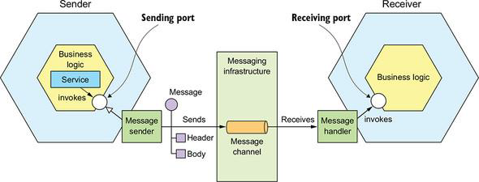</td>
<td>Fire-and-Forget</td>
</tr>
<tr>
<th>Request/ Async-Response-Pattern</th>
<td>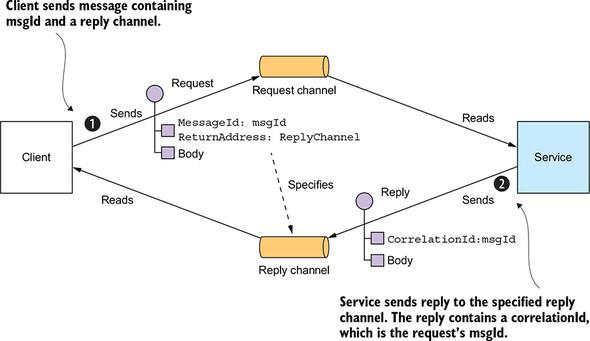</td>
<td>Response ist Asynchron</td>
</tr>
<tr>
<th>Messaging-Based Service API</th>
<td>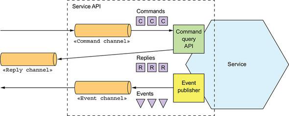</td>
<td>Event-Channel ist eine „One-Way“-Benachrichtigung an alle interessierten Services.</td>
</tr>
</table>


