## Advanced Software Engineering Zusammenfassung 

Klausurthemen:

Entwurfsprinzipien

software-architektur styles / Pattern

Design-Pattern

Webservices Old styl wsdl soap

REST, wieso im Vergleich zu anderen assync Technologien wie RMI

REST realisieren: spring

Rest erklären können warum was etc. Spring

Single-sign on

transaktionen, verteilte (Tranaktionsprotokoll)

2 Phasen commit

Was ist Kafka?

Domain Driven Design

CAP-Theorem

12-Faktor apps, was ist cloud enabled, auf was achten, wenn Vorteile in cloud nutzen

desired State, orchestrierungsplatform für Docker

Kubernetes -> self healing, skalierbarkeit, versucht gewünschten Zustand herzustellen

Single Sign on

Keycloak


# Patterns 
## Eigenschaften
- basieren auf realen Designs
- zeigen tiefergehende Strukturen und Mechanismen eines Systems
## Implementierung
>abstrakter Lösungsentwurf
<!---->


---

# Creational Patterns 
Erzeugung von Objekten => Entkoppelt Konstruktion eines Objekts von Repräsentation

## Factory Pattern
Erzeugungsmethode (gibt Objekt des gewünschten Typs zurück)

## Abstract Factory Pattern
abstract Factories ermitteln Erzeugungskontext automatisch

Interface stellt Objekt erzeugungs Methode bereit. Erbende Klassen Implementieren diese (und erzeugen in Methode Objekt)


### Beispiel zwei überlappende Factories


## Builder Pattern

trennt Konstruktion (eines Objektes) von Repräsentation.

> **Problem**: Konstruktorparameter müssen im Konstruktor klar definiert sein!
```java
class A{
    A(int a, b){}
    A(int b, c){} //Fehler
    A(int a, c){} //Fehler
}
```
>Parameter könnten per Setter Methoden gesetzt werden -> große Fehlerquelle (Initialisierung über mehrere Zeilen)

Lösung durch erzeugung interne Builderklasse. Enhält für jeden Parameter äquivalent und wird an Konstruktor übergeben. 

```java
Class A{
    private int a;
    private int b;
    private int c;
    A(ABuilder builder){
        this.a = builder.a;
        this.b = builder.b;
        this.c = builder.c;
    }
    class ABuilder{
        int a = 0;
        int b = 0;
        int c = 0;
        public ABuilder setA(int a){
            this.a = a;
            return this;
        }
        public ABuilder setB(int b){
            this.b = b;
            return this;
        }
        public ABuilder setC(int c){
            this.c = c;
            return this;
        }
        Public A build(){
            return new A(this);
        }
    }
}
```
Aufruf:
```java
A a = new A.ABuilder().setA(1).setB(2).setC(3).build();
```

## Singleton
höchstens ein Objekt der Klasse darf existieren
>> singleton ist Global Accessible => **Das Singleton ist keine globale Variable!**

**Lazy Implementierung**
>**nicht** thread-safe!
```java
public class Singleton {
    private static Singleton instance;
    private Singleton() { }
    public static Singleton getInstance()
    {
        if( instance == null )
        {
            instance = new Singleton();
        }
        return instance;
    }
}
```
**Eager Implementierung**
>thread-safe
>> Instanziierung an laden der Klasse gebunden
```java
public class Singleton
{
    private static Singleton instance = new Singleton();
    private Singleton() { }
    public static Singleton getInstance()
    {
        return instance;
    }
}
```
**Implementierung mit Holder-Klasse**
>**Java only**

Erzeugung des Singletons an laden der internen Klasse gebunden
```java
public class HolderSingleton
    {
    public static class Holder
    {
    private static HolderSingleton instance = new HolderSingleton();
    }
    public static HolderSingleton getInstance()
    {
        return Holder.instance;
    }
    private HolderSingleton() { }
}
```
## Prototype Pattern
**Copy & Paste & Modify**

# Structural Patterns

vorgefertigte Schablonen (Beziehungen zwischen Klassen)

## Adapter Pattern
zwei Versionen(Objekt-Adapter / Klassen-Adapter)

>Lollypop Schnittstelle -o )-
> **Kompatibilität zwischen Schnittstellen => Keine neue Funktionalität => Nur eine Delegation**
### Objekt-Adapter


### Klassen-Adapter


## Decorator

>*"funktionale objekterweiterung => Funktionalität hinzufügen (gleicher typ)"*

Unterschied Wrapper: Wrapper fügt (in Java) keine Funktionalität hinzu
Wrapper = Typkonvertierung 

Erweitert Objekt um Funktionalitäten => vgl: Pizzabelag

Problem: **Großer Vererbungszweig/Vererbungsbäume**

Organisierung in Ketten

(Dekorator 1) -> (Dekorator 2) -> (Dekorator 3) -> (Konkretes Objekt)

> Wichtig: **Austauschbarkeit**

Kein Referenzvergleich == mehr möglich (Equals und Hash überschreiben)

Erzeugung meist durch Factories

Dekorator verdeckt Objekt-ID


## Proxy

Stellvertreter Objekt

Remote Proxy: Bsp. Remote Zugriff auf ein Objekt 

>**Nicht Read-Only** Per Set Methode können Daten bearbeitet werden
>> **nur** stellvertretenden Zugriff auf Fremdes Objekt

>(alt)RMI / (neu)REST


## Adapter vs. Decorator vs. Proxy

Adapter = Überbrückung zweier Schnittstellen
Decorator = Erweitert Funktionalität des ursprünglichen Objekts
Proxy = Besitzt selbe Schnittstelle und zeigt selbes Verhalten


## Bridge Pattern
>*"Vgl golden gate Brigde: verbindung zweier Landzungen" => "Adapter für Klassenhierarchien"*

Verbindet größere Schnittstellen

>*"Vgl: Treiber (JPA oder JDBC) Großer Adapter zwischen Abstraktion und Implementierung"*
>>*"Schnittstelle mit großer Hierarchie wird adaptiert"*

<div style="display: flex; justify-content: space-around;">
    
    
</div>

## Facade / Fassade

Verbirgt Komplizierte Klassenkonstrukte => Schnittstelle


### Vorteile

Vereinfacht:
- komplexes Domain Model

- Austausch von Implementierungen

### Nachteile
- Mutieren oft zu Monsterklassen
- Keine Isolierung des Sub-Systems => Soll idR. Zugriffe auf dahinterliegende Objekte zulassen und erleichtern
> Einfache Zugriffsschnittstelle für komplexere Aufrufe

## Composit 

hierarschicher Aufbau einer Datenstruktur

**Einsatzzweck:**
- Aufbau flexibler hierarchischer Struktur
- Bestandteile können einheitlich behandelt werden

> **Bsp. Baum-Datenstruktur, Dateisystem**


# Behavioral Patterns

Modellieren komplexes Verhalten (erhöht Flexibilität)

- Replacement Principle
- erhöhte komplexität

**so einfach wie möglich so komplex wie nötig!**

## Command

Arbeitsanweisungen als Objekt 

>**IntUnaryOperator** = Damit können Lambdaausdrücke genutzt werden 
```Java
public static void main(String[] args)
{
    System.out.println("Summe " + sum(0,10, i -> i) );
    System.out.println("Summe Quadratzahlen " + sum(0,10, i -> i*i) );
}
private static int sum(int start, int end, IntUnaryOperator function)
{
    int sum = 0;
    for(int i=start; i < end; i++)
    {
        sum += function.applyAsInt(i);
    }
    return sum;
}
```

### Erweiterungen
#### Command Stack

Bsp. Undo


#### Command-Broker

übergibt passenden Commandhandler die Aufgabe (evtl übernimmt Commandbroker Aufgabe selbst)

Executoren entsprechen Execution-Brokers 
=> z.B. Executor Service


## State Pattern

Wechseln von Zuständen bei Input

### Prozedurale implementierungsvariante 
> Aktueller Zustand => Ereignis => Bedingung/Folgezustand


Vorteil = Ablauforientiert
```Java
while (index < eventSequenz.length()) {
    char event = eventSequenz.charAt(index);
    switch (state) {
        case "Q1":
            switch (event) {
                case 'a': state = "Q2"; break;
                case 'b': state = "Q1"; break;
                default: System.err.println("Falsches Event");
            }
        break;
        case "Q2":
            …..
        case "Q3":
            …..
        default: System.err.println("Falscher Zustand");
    }
```
Nachteil: Zeitaufwendig (anpassung von allen switches bei neuem Zustand)

### Implementierungsart mit Zustandsklassen

> Implementierungsvariante als Graph
>> Knoten und Kanten => Zustand hat mehrere Knoten für jedes Event
>>> - Knoten = Zustandsübergänge
>>> - Kanten = Zustände
>> - nachbau der Struktur nach: State A hat Übergang zu B, C, D
>> - Bsp Web oder Webframework


```Java
public class Q1 extends Zustand
{
    @Override
    public Zustand processEventA() { return new Q2(); }
    @Override
    public Zustand processEventB() { return this; }
}
public static void main(String[] args)
{
    Zustand state = new Q1();
    state = state.processEventA().processEventB().processEventA();
    System.out.println( state.getClass().getSimpleName() );
}
```

### Graph Implementierung


Parameter konfigurieration von außen
> Grundlagen zuerst: Transitionsmodelle, etc.

## Template Method

abstrakte Klasse Figur deklariert Methode um Figur zu zeichnen. alle erbende Klassen implementieren draw-Methode


## Problem 1: konkrete Implementierung von draw() benötigt Zugriff auf Farbwert

### Lösung 1: Implementierung eines Farbattributes


Nachteil: prepare-Aufruf kann werden vergessen => **erhöhte Komplexität**

### Beispiel: Implementierung einer getColor() Methode


## Strategy

Erlaubt Austausch/Konfiguration zur Laufzeit.

*"Wenn sie etwas sortieren wollen können sie den Sortieralgorithmus austauschen"*

Beispiele:
1. Comparator
2. Baum-Beispiel: iteriertion ("Traversierung") wird anhand Strategie festgelegt 


## Observer
Vgl Callback (events)

Umsetzung unterscheidung in drei Arten:

- Push Notification
    - WasUpdated (no Payload)
- Push Update
    - Push Update (with Payload)
- Pull Notification
    - Update Request (von Ovserver)

> **"MCV Pattern ist Observer => View ist Observer von Model"**

---

# Design Prinzipien

## SOLID

## S = Single Responsibility

### SRP: Single Responsibility Principle
- Klasse/Funktion nur eine Funktionalität
=> Vermeidung von Seiteneffekten

<div style="display: flex; justify-content: space-around;">

<div width=40><p>=></div>

</div>

## O = Open-Closed

### OCP = Open Closed Principle

- open = erweiterbarkeit
- closed = keine Veärnderungen am bestehenden Quellcode notwendig (bei erweiterung)
=> Vermeidung von Seiteneffekten

<div style="display: flex; justify-content: space-around;"> 

<div width=10><p>=></p></div>

</div>

Wird erreicht durch:
- Unterteilung in Komponenten
- Komponenten in Abhängigkeitshierarchie
- Komponenten niedrigerer Ebenen durch Änderungen von Komponenten höherer Hierarchien schützen


## L = Liskovsches Substitutionsprinzip

### Liskovsches Substitutionsprinzip
- "Leitlinie für Vererbung"
- Unterklassen müssen Oberklassen substituieren
> Untergeordnete Klassen können überliegenden vollständig ersetzen

## I = Interface Segregation

### ISP = Interface Segregation Principle
Keine abhängigkeit von nicht verwendeten Interfaces

**Unnötige Interfaceverkettungen oder große/riesige Interfaces vermeiden!**

Lösung = kleine Interfaces (verkörpern nur eine Eigenschaft) 

## D = Dependency Inversion

### DIP = Dependency Inversion Principle

Keine abhänhigkeit von modulen niedriger Ebene.

=> "High-Level"(Layer) sollen nicht von "Low-Level"(konkrete Implementierungen) abhängig sein

> Abhängigkeiten von stabilem konkreten Code sind erlaubt.

## API-Design
Benutzbarkeit = Leicht verständlich + erlernbar
Effizienz = geringe Übertragung von Datenvolumen
Zuverlässigkeit = Fehlerbehandlung

**Wichtig:**
- Konsistenz = Durchgängige Namensgebung
- Verständlichkeit = Konventionen
    - Getter und Setter bennennen (getId(), setId(int id))
- schwer falsch zu benutzen
- Leaking References vermeiden
    - keine Referenzen zurückgeben (modifizierbare Interna)
- Keine null Rückgaben!
    - eigenen Typ/Fehler zurückgeben statt null

## Weitere Konzepte

### DRY = Dont Repeat Yourself
Redundanz vermeiden, Funktionalität zentralisieren


**Kann Abhängigkeiten einführen**

### YAGNI = You Aren´t Gonna Need It

Unnötiges weglassen => Erst implementieren wenn benötigt

### KISS = Keep It Simple And Stupid

=> höhere Komplexität:
 - verringert Wartbarkeit
 - behindert Wiederverwendbarkeit
 - erhöht Anzahl Fehlern 

## Fazit von Design Prinzipien
führt nicht automatisch zu besserer Software: "es kommt darauf an!"

# Architekturen für Verteilte Systeme

Zusmmenschluss unabhängiger Computer
- keinen gemeinsamen Speicher
- kommunizieren mit Nachrichten

## Client-Server-System
Viele Clients, ein Server

## Verteilte Anwendung
Programmierung der Anwendung

## Verteiltes Betriebssystem
für Benutzer und Anwendungen nicht sichtbar

## Schichtenarchitektur

- Graphische Präsentation (Benutzeroberfläche)
- Benutzungsinterface (Interaktionssteuerung)
- Datenverarbeitung (Business-Logic)
- DBMS = Datenbankmanagementsystem
    - Datenmanagement
    - Daten


> Verstecken von Komplexität (zugriff nur eine Schicht runter)

## Monolitische Systeme


### Standalone-Systeme = Alles auf einem Rechner


### Komplette Anwendung läuft zentral auf einem Server

Interaktive Benutzung über Terminals


## Client/Server-Systeme

Leistungsfähige PCs ermöglichen Ausführung auf Nutzerrechnern
- Bsp. Fileserver, Datenbank-Server, Workflow-Engines


1. Logik auf Client
2. Logik in der Datenbank (Stored Procedures)
3. Logik und Anwendungssteuerung innerhalb des DBMS

## Klassische Two-Tier Architektur


Vorteile
- Einfaches Programmiermodell
- Applikationslogik liegt hauptsächlich auf dem Client

Nachteile
- Hohe Anforderungen an die Client-Rechner (hohe Kosten)
- Nicht unbegrenzt skalierbar
- Softwareverteilungsproblem: Client-Versionen müssen synchron sein

## Verteilte-Anwendungen / Three-Tier / n-Tier Architekturen


Verteilung des Programms auf diverse Rechner
kann erfolgen:
 - Vertikal (Schichten auf unterschiedlichen Rechnern)
 - Horizontal (Anzahl der Schichte)
 - in beiden Dimensionen


Aufteilung in:
 - DB
 - Logik(Backend) 
 - Presentation(Frontend)

 


## Middelware

liegt zwischen OS der Rechner (Rechner A, B, C) und verteilter Anwendung 
bietet Middleware-Services z.B.:

- Namensdienst
- Kommunikationsdienst
- Filedienst
- Zeitdienst
- Konkurrenzdienst
- Transaktionsdienst
- Sicherheitsdienst

bieten Standardfunktionen (vereinfacht verteilter Anwendungen)


## Kommunikationsarten
<table>
<th>Synchron</th>
<th>Asynchron</th>
<tr>
<td>http, REST</td>
<td>fetch(JavaScript), JMS(Messaging)</td>
</tr>
</table>


<table>
<th>One-to-One</th>
<th>One-to-Many</th>
<tr>
<td>http, Rest, fetch, JMS mit Queues</td>
<td>Eventauslieferung beim Observer, JMS mit Topics</td>
</tr>
</table>

### Synchrone Kommunikation


### Asynchrone Kommunikation 


### Kommunikationsfehler

- Request verloren/verzögert
- Response verloren/verzögert
- Client/Server nicht verfügbar

> Resend?, Timeout? etc.

# RMI (Remote Method Invocation)
RMI = Java-Realisierung Interprozesskommunikation
Aufruf von Methoden entfernter Objekte

>>Stub+Skeleton Repräsentieren Platzhalter => Proxy

## Architektur von RMI

Server = Dienstanbieter
Client = Dienstnehmer

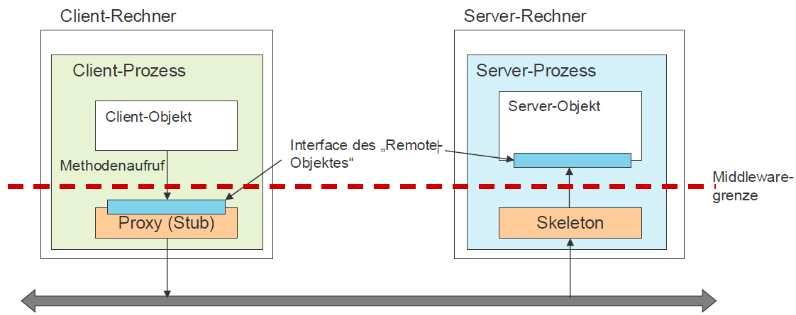

Reihenfolge der Ausführung relevant

## Middleware bei RMI
- Stub = Proxy => Netzerkrequest 
- Skeleton = Socketlistener = Nimmt Netzwerkrequest entgegen + verwaltet Serverobjekt

Warnung: Multithreading 

## Parameterübergabe
Call by Value

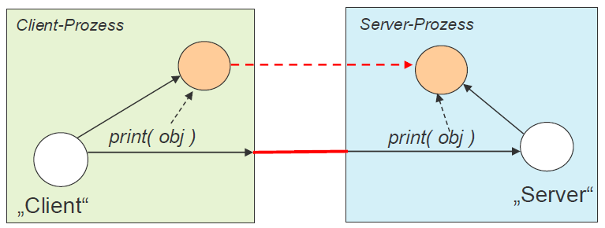

## Callback Design
- Server -> Client benachrichtigung
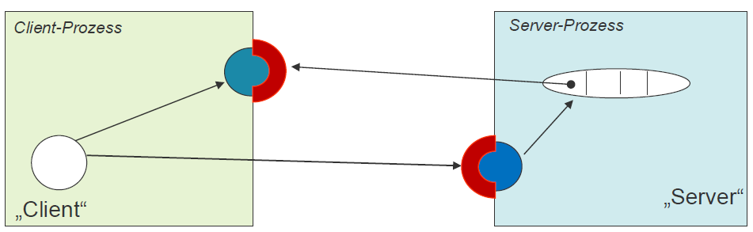

## Distributed Garbage Collection
Objekt darf erst gelöscht werden, wenn:
- keine lokalen Referenzen existieren
- keine entfernten Referenzen existieren

Zusätzlich kann mit Timeout gearbeitet werden.

## Java Naming and Directory Service
Bsp. für Naming Service = RMI_Registry
Naming Service enthält Name-Value-Paare

## Alternativen für RMI
CORBA (Common Object Request Broker Architekture)
Probleme mit CORBA => nicht Internettauglich


# Service Oriented Architekture (SOA)

Strukturierung und Nutzung verteilter Funktionalität
> Anwendungslandschaft aus einzelnen Anwendungen
> - Anwendungen lose gekoppelt (bieten Funktionalitäten durch Services an)

**Idee der SOA = Schnittstellen werden zu standartisierten Services umfunktioniert**
> - benötigt Mechanismen zum Finden und Kommunikation mit Services
> - Middleware orchestriert (ist selbst als Service erreichbar)


# Web Services
- XML Standards
- Textbasiert ("Jede Programmiersprache kann Text")

## Web Service Dreieck


> UDDI = Universal Description, Discovery, and Integration => Naming Service

## SOAP = Simple Opject API (SOAP)
legt fest, wie Nachrichten aufgebaut sein müssen
SOAP = Kommunikationsprotokoll (textbasiert)


## WSDL = Web Service Definition Language
XML-Vokabular zur Beschreibung von Schnittstellen

WSDL beschreibt:
- bereitgestellte Funktionen
- Datentypen der Nachrichten (Request und Response)
- Für Protokoll relevante Informationen
- Adressen unter denen Dienste erreichbar sind


## Arten des Nachrichtenaustauschs


# Java Messaging System (JMS)

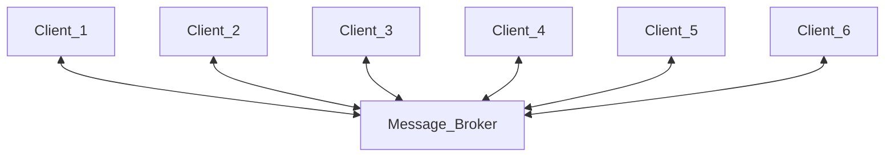
- Nachricht = Paket aus Daten und Routing Informationen
- Nachrichtenversand über MOM
>Nachricht an Message Broker = Synchron
>Asynchron durch zeitliche Entkoppelung
>>Kommunikation zwischen Teilelementen = Asynchron


## MOM = Message Orientated Middleware


### Messaging Modelle


#### Publish Subscribe (Pub/Sub)(1 -> Viele)


#### Point to Point (P2P) (1->1)


## Broker Varianten

- Internal Broker = direkt innerhalb Anwendung oder Application Servers
- External Broker = eigenständiger externer Service
- Embedded Broker = einbettung in Anwendung


## Features
### Selektoren
"Filtern" Nachrichten auf bestimmte eigenschaften

### Temporäre Queue
"privater" Kanal 
=> asynchrones Request/Response möglich


## Anwendungsfälle
<table>
<tr>
<th>Nachrichtenaustausch</th>
<td></td>
<td>Fire-and-Forget</td>
</tr>
<tr>
<th>Request/ Async-Response-Pattern</th>
<td></td>
<td>Response ist Asynchron</td>
</tr>
<tr>
<th>Messaging-Based Service API</th>
<td></td>
<td>Event-Channel ist eine „One-Way“-Benachrichtigung an alle interessierten Services.</td>
</tr>
</table>


# Verteilte Transaktionen

Transaktionen über mehrere transaktionale Systeme


## ACID

- A–Atomar
    - ausführung komplette oder gar nicht (commit oder abort)
- C–Konsistent
    - Transaktion überführt konsistenten Zustand in anderen konsistenten Zustand
- I–Isoliert
    - Seiteneffektfrei (kann Nebenläufig ausgeführt werden)
- D–Dauerhaft
    - Änderungen nach Transaktion dauerhaft gespeichert
    - muss auch nach Systemfehler garantiert sein

ACID kann nur von relationalen Datenbanken garantiert werden. NoSQL-Datenbanken garantieren nicht alle ACID-Funktionalitäten. NoSQL nutzt häufig BASE.

## Transaktionsmanager


### Ablauf


<table>
<tr>
<td></td>
<td>beteiligten Systeme geben Autonomie auf</td>
</tr>
<tr>
<td></td>
<td>
1.      Anwendung eröffnet Transaktion => Erhält Transaktions-ID<br>
2-3.    Beteiligte Ressourcen registrieren sich bei Transaktionsmanager unter der Transaktions-ID<br>
4.      Anwendung beendet (commit oder abort) die Transaktion mit Transaktions-ID<br>
5.      Transaktionsmanager führt Commit-Protokoll mit den an Transaktions beteiligten Ressourcen durch.
</td></tr></table>

## 2-Phasen Commit Protokoll


## X/Open-Transaktionsmodell


- Anwendungsprogramm initiiert Transaktionen über TX Interface.
- Transaktionsmanager koordiniert Transaktionen
- Die Resource Manager führen Operationen (Lesen, Schreiben) aus
## BASE

- BA = Basically Available 
    - Stellt garantiert allen Benutzern Abfragen zur Verfügung => Keine Konsistenz garantiert
- S = Soft State 
    - States können sich über äußere Einflüsse andern
- E = Eventually Consistent 
    - Zustand des Systems wird schrittweise über alle Knoten repliziert.
        - System wird nach und nach konsistent

Beispiel der Microservice Architektur => Nicht mit 2-Phasen-Transaktion umsetzbar => Funktioniert einfach nicht

## SAGA - Transaktionsmodell


Sequenz von Transaktionen, welche Dinge aktualisieren 
Jede Änderungsoperation die ich habe muss eine Rückgängigkeitsmöglichkeit haben
>=> Aufteilung einer verteilten Transaktion in lokale Transaktionen.


### Pattern: Orchestrierung

Merkhilfe => Orchester mit Dirigent => Ohne Dirigent kann Orchester nicht spielen


Nachteile:
- System abhängig von "Dirigent"
- "Dirigent" = "Flaschenhals"

### Pattern: Choreographie

Merkhilfe => Balett => Jeder weiß was er zu tun hat (abschauen ob bei Nachbar alles klappt)


## CAP-Theorem


- C - Consistency (Konsistenz)
- A - Availability (Verfügbarkeit)
    - jederzeit Lese- und Schreibzugriffe
- P - Partition Tolerance (Ausfalltoleranz)
    - System kann trotz Ausfalls einzelner Knoten weiterarbeiten

> **immer nur 2 möglich (CA, CP, AP)**

# REST (Representational State Transfer)


## Motivation für REST
Motivation = viele Programme innerhalb einer Firma
Benötigt wird ein "einheitliches" Kommunikationsprotokoll, welches von allen Anwendungen unerstützt wird.
=> Http
=> JSON / XML => Programmiersprachenunabhängig

## Rest als Beschreibungsformat
Rest ist keine Architektur, sondern ein Rahmen für einen Architekturstil!
> Häufig Client/Server Architektur auf Basis von HTTP als Trägerprotokoll
>> RESTful HTTP

**Rest schreibt kein Protokoll vor, wird aber i.d.R mit HTTP verwendet**

## Exkurs HTTP

HTTP ist ein einfaches Textbasiertes Client-Server-Protokoll

GET, POST, PUT, DELETE, etc. => HTTP Aufrufe

Rest kennt nur Ressourcenbegriff
Ressource ist alles auf das zugegriffen oder verändert werden kann

## Fünf Prinzipien von REST
1. Ressourcen besitzen eine eindeutige ID (adressable ressources)
    - Bei RESTful HTTP sind das URLs
2. Ressourcen können unterschiedliche Repräsentationen besitzen
    - Bei RESTful HTTP ist das oft JSON oder XML
3. Standartisierte Methoden
    - Bei RESTful HTTP sind das die HTTP-Methoden GET, POST, PUT, DELETE
4. Statuslose Kommunikation
    - HTTP ist zustandslos
5. Hypermediaverwendung
    - Hypermedia As The Engine Of Application State (HATEOAS)
    - Ressourcen können verknüpft werden über Links
    - Wird von den meisten REST-Anwendungen nicht verwendet

## Architekturprinzip: Adressierbarkeit

Adressierung über URI

=> Adressierung über HTTP
http://example.com/kunde?name=Harry&plz=66482

- ```http``` entspricht Protokoll
- Standart Port ist 80
- ```Kunde``` entspricht Ressource bzw. Prad zu Ressource
- ```name=Harry&plz=66482``` ist der Query-String


Da jeses Objekt eine URI besitzt, können Ressourcen verlinkt werden (JSON-FORMAT)
```{json}
{
    "name": "Luke Skywalker",
    "hair_color": "blond",
    "homeworld": "https://swapi.dev/api/planets/1/",
    "films": [
        "https://swapi.dev/api/films/2/",
        "https://swapi.dev/api/films/6/",
        "https://swapi.dev/api/films/3/",
        "https://swapi.dev/api/films/1/",
        "https://swapi.dev/api/films/7/"
    ]
}
```

## Repräsentationen

Ressource ist eine Abstraktion, von der bei Bedarf eine Repräsentation erzeugt wird
```{json}
{
    'name' : 'Albert'
    'id' : '42'
}
```
> Repräsentation einer Person durch ID und Name

### Repräsentationsanforderung
Clients können über URLs Ressourcen identifizieren und übebr HTTP-Methoden abrufen
Clients geben in der Regel die Repräsentationsform an, die sie erwarten
```
GET products/143 HTTP/1.1
Host: www.example.com
Accept: application/xml, application/json => Repräsentationsform, welche akzeptiert wird
```

## Standartisierte Methoden

**GET, PUT, DELETE sind idempotent**
**Nur POST ist nicht idempotent**

Idempotent => Hat einmal eine Wirkung, beim zweiten mal jedoch keine
> Beispiel |-3| = 3 => ||-3|| = 3 => Der zweite Betrag hat keine Wirkung

Als Daumenregel gilt für CRUD(Create, Read, Update, Delete)
<table>
    <th>Aktion auf der Ressource</th>
    <th>HTTP-Methode</th>
    <th>RPC-Style Schnittstelle</th>
    <td>RESTful HTTP</th>
    <tr>
        <td>CREATE</td>
        <td>POST</td>
        <td>addBook()</td>
        <td>POST /books</td>
    </tr>
    <tr>
        <td>READ</td>
        <td>GET</td>
        <td>getBooks()</td>
        <td>GET /books</td>
    </tr>
    <tr>
        <td></td>
        <td></td>
        <td>getAuthorsFromBook()</td>
        <td>GET /books/{id}/authors</td>
    </tr>
    <tr>
        <td>UPDATE</td>
        <td>PUT bzw. PATCh</td>
        <td>updateBook()</td>
        <td>PUT /books/{id}</td>
    </tr>
    <tr>
        <td>DELETE</td>
        <td>DELETE</td>
        <td>deleteBook()</td>
        <td>DELETE /books/id{id}</td>
    </tr>
</table>


## Statuscodes
Der Server kann durch HTTP-Statuscodes Informationen an den Client zurückgeben

|Statuscode | Wirkungsbereich |
|:---:|---|
|1xx    |   dient Informationszwecken und signalisiert, dass die Bearbeitung noch nicht abgeschlossen ist|
|2xx    |   signalisiert, dass die Bearbeitung erfolgreich abgeschlossen wurde
|3xx    |   Zeigt Umleitungen an
|4xx    |   wird für Client-seitige Fehler benutzt
|5xx    |   signalisieren Fehler, die bei der Bearbeitung der Anfrage auf dem Server aufgetreten sind.

### Wichtige Statuscodes

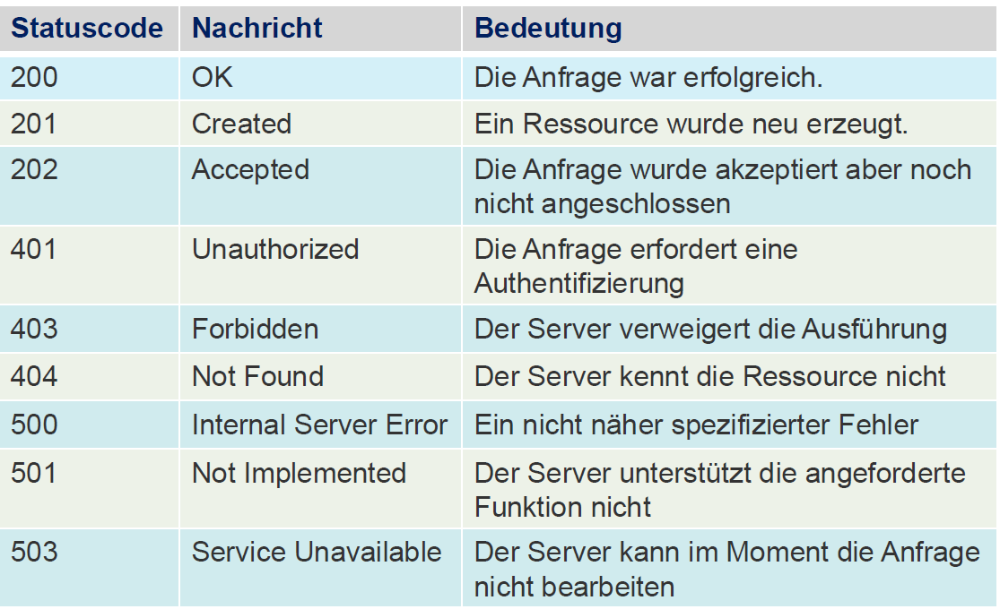


## Richardson Maturity Model
Kathegorieren klassifizieren RESTful-Anwendungen nach Reifegrad


- Level 0
    - Http als Transportprotokoll

- Level 1
    - Ressourcen-Begriff wird verwendet => Ressourcen über eindeutige URLs angesprochen
    
- Level 2
    - HTTP-Befehle werden für CRUD verwendet
- Level 3
    - HATEOAS => Ressourcen sind über Links verbunden und "selbstbeschreibend"

## Hypermedia 
Hypermedia = Hypertext + Multimedia
Links zur Verknüpfung verschiedener Medien


## REST als Architekturstil

- Definiert die Anwendung als ein System verteilter Ressourcen, welche über Links miteinander verbunden sind.
- Im Zentrum einer REST-API stehen die Ressourcen, welche über URLs identifizierbar(über Links erreichbar) sind.
- Um Ressource zu verändern muss Repräsentation der Ressource verändert an diese geschickt werden.

## Best Practices 
1. Nomen für Ressourcen im Plural
    - ``` /vehicles => Fahrzeuge ```
    - ```/vehicles/12 => Fahrzeug nummer 12 ```
2. Keine Verben in URLs
    - ``` /getColor ``` Schlecht
    - ``` /color ``` Gut
3. Kein / am Ende
    - ``` /vehicles/data/power/ ``` Schlecht
    - ``` /vehicles/data/power ```Gut
4. Vorsicht bei Verwendung von Trennzeichen
    - ``` /testAPI/dasIstNixGut ``` Schlecht
    - ``` /testAPI/das_ist_nix_gut ``` Schlecht
    - ``` /testAPI/das-ist-okay ``` Gut


# Microservices

Vorteile: Skalierbarkeit, Geschwindigkeit, Kopplung, etc.

Nachteile: Automatisches Build- und Deployment notwendig, Komplexe Infrastruktur und Runntime (Cloud) notwendig

## Typisches Implementierungsszenario für Produkt am Beispiel Monolith

Benutzung CI-Pipeline

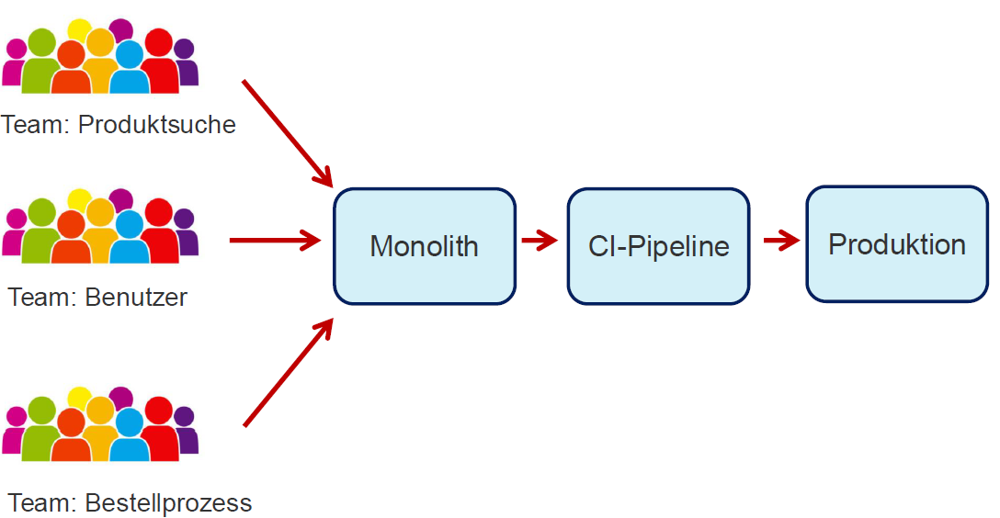

## Conways Law

*Any organization that designs a system (defined more broadly here than just information systems) will inevitably produce a design whose structure is a copy of the organization’s communication structure.* - Melvin Conway: “How Do Committees Invent?,” Datamation, April 1968

> In Simpel: Die Struktur einer Organisation spiegelt sich in den Systemen wider, die sie entwickelt.
>> Wie ein Team organisiert ist und miteinander kommuniziert, beeinflusst direkt, wie die von diesem Team entwickelten Produkte und Systeme aussehen.

## Teamrollen in Microservices 

|Klassisch |Microservices|
|-----|-----|
| 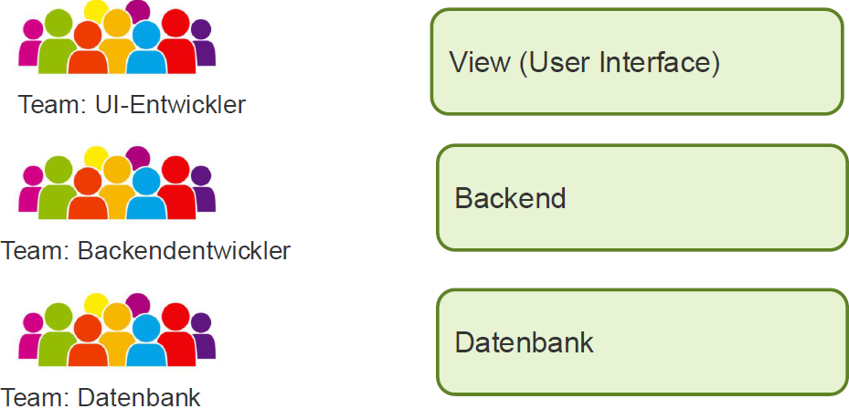 | 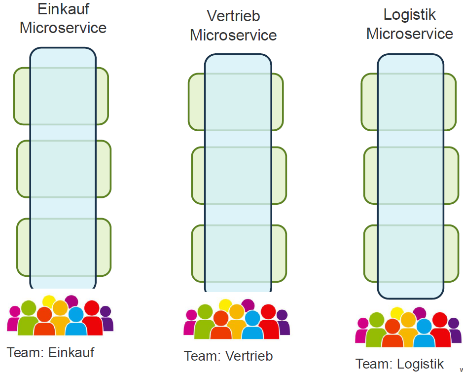


## Definition Microservices
Architekturstil bei der Anwendung in kleine Teile aufgeteilt wird, die unabhängig voneinander entwickelt werden und installiert werden

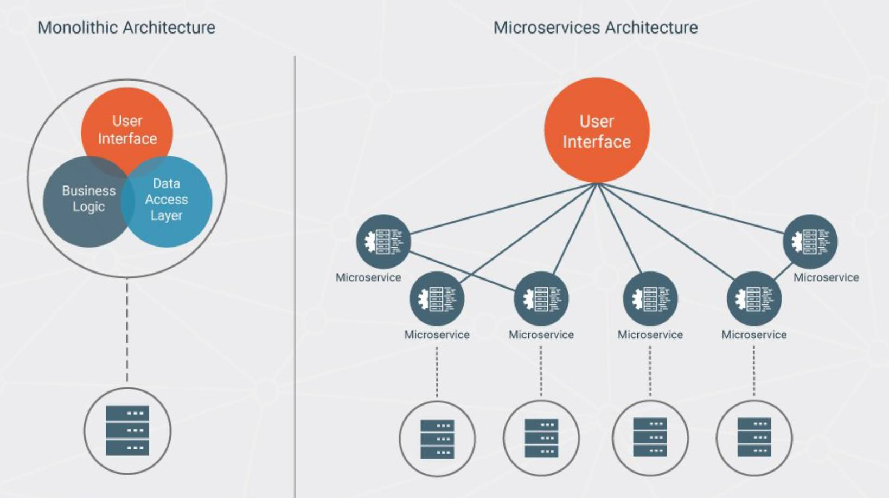

## Technische Kommunikation 

Ein Microservice stellt seine Funktionalität über eine REST-API und/oder ein Topic zur Verfügung.

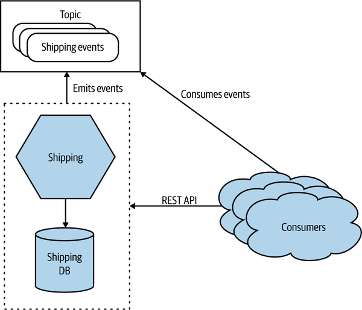

## Skalierungsmöglichkeiten


Daraus resultiert CAP-Theorem 

## The Twelve Factors

Definiert Best Practices für Anwendungen
|Nr|Beschreibung|Definition|
|-----|-----|-----|
|1  |   Codebase                    |   Eine im Versionsmanagementsystem verwaltete Codebase, viele Deployments
|2  |   Abhängigkeiten              |   Abhängigkeiten explizit deklarieren und isolieren
|3  |   Konfiguration               |   Die Konfiguration in Umgebungsvariablen ablegen
|4  |   Unterstützende Dienste      |   Unterstützende Dienste als angehängte Ressourcen behandeln
|5  |   Build, release, run         |   Build- und Run-Phase strikt trennen
|6  |   Prozesse                    |   Die App als einen oder mehrere Prozesse ausführen
|7  |   Bindung an Ports            |   Dienste durch das Binden von Ports exportieren
|8  |   Nebenläufigkeit             |   Mit dem Prozess-Modell skalieren
|9  |   Einweggebrauch              |   Robuster mit schnellem Start und problemlosen Stopp
|10 |   Dev-Prod-Vergleichbarkeit   |   Entwicklung, Staging und Produktion so ähnlich wie möglich halten
|11 |   Logs                        |   Logs als Strom von Ereignissen behandeln
|12 |   Admin-Prozesse              |   Admin/Management-Aufgaben als einmalige Vorgänge behandeln

=> Wichtig für Cloud Anwendungen
=> Je mehr erfüllt sind desto solider die Anwendung

## Evolution 

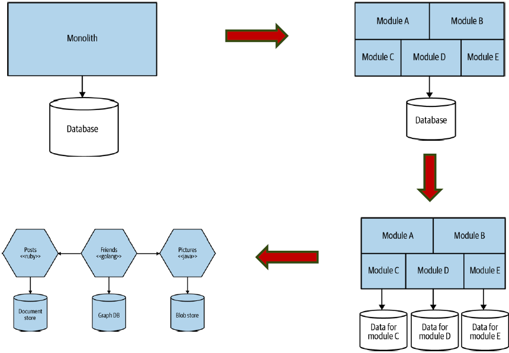

1. Matschball wird in Module unterteilt
2. Trennung von Daten
3. Module udn DBs werden geschnitten 

## Definition Microservice

Das Konzept der Microservices basiert auf der Idee, Anwendungen in kleinere, unabhängig voneinander arbeitende Dienste aufzuteilen. Dies ermöglicht flexibleres Entwickeln und Bereitstellen von Anwendungen, stellt jedoch keine universelle Lösung dar.

### Vorteile

▪ Ermöglicht die kontinuierliche Bereitstellung und den Einsatz großer, komplexer Anwendungen.
▪ Dienste sind klein und leicht zu warten.
▪ Dienste können unabhängig voneinander bereitgestellt werden.
▪ Dienste sind unabhängig skalierbar.
▪ Ermöglicht es Teams, autonom zu arbeiten.
▪ Ermöglicht ein einfaches Experimentieren und die Übernahme neuer Technologien.
▪ Bietet eine bessere Fehlerisolierung.

### Nachteile

▪ Es ist eine Herausforderung, die richtigen Dienste zu finden.
▪ Verteilte Systeme sind komplex, was die Entwicklung, das Testen und die Bereitstellung erschwert.
▪ Die Bereitstellung von Funktionen, die mehrere Dienste umfassen, erfordert eine sorgfältige Koordination.
▪ Die Entscheidung, ob und wann die Microservice-Architektur eingeführt werden soll, ist schwierig.


## Service als hexagonale Architektur

Man nutzt REST für Benutzer und Queues für die Services untereinander
Bsp. MQTT , ActiveMQ oder Kafka

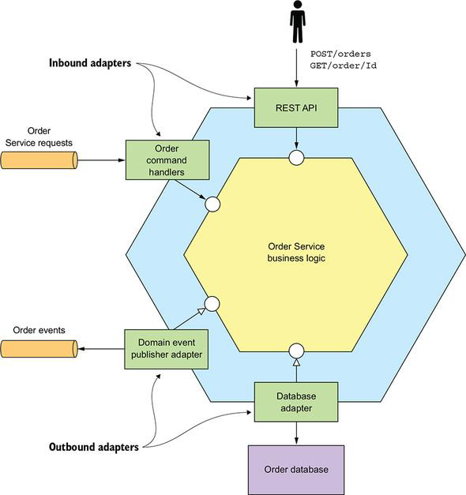

Besteht aus Business-Logik, einem oder mehreren Adaptern, welche Schnittstellungen zu externen Anwendungen und anderen Diensten bilden.

## API-Gateway

Ein API-Gateway beschreibt eine Verteilerschnittstelle / Zentrale Schnittstelle, welche auf die anderen Schnittstellen zugreift.

Ein API-Gateway kann eine mehrschichtige modulare Architektur besitzen. Die gemeinsame Schicht implementiert Funktionen, die allen APIs gemeinsam sind, z.B. Authentifizierung


### Single Entry Point Gateway-API


# Domain Driven Design (DDD)


Domain Driven Design beschreibt eine Vorgehensweise zur Modellierung komplexer Software im Großen und im Kleinen. Das Ziel hierbeit ist es Softwarelösungen im Einklang mit den Fachdomänen zu entwickeln. Ein Hauptmerkmal ist die Verwendung einer einheitlichen Sprache (ubiquitous language), welche von Fachexperten genutzt wird, durch welche Später die Bounded Contexts erstellt werden können.
> Software ist in einer Anwendungsdomäne verankert d.h. Im Kontext einer Bankanwendung geht es bsp. fachlich um Geld, Kredite oder Aktien.


> Jede Abteilung hat eigene Sicht auf die Komponenten und Akteure der Software. => Eigene Fachsprache

**Im Zentrum steht der Bounded Context**


## Ablauf Softwareentwicklung

*"There is no sense in talking about the solution before we agree on the problem,
and no sense talking about the implementation steps before we agree on the
solution."* - Efrat Goldratt-Ashlag

> In verständlich: Erst wenn die Anforderungen genau definiert sind lohnt es sicht ein Fachmodell zu entwickeln und erst dann sollte die Zielarchitektur geplant werden.


## Arten von Komplexität

1. Essentielle Komplexität
    - Innenwohnende Komplexität der Fachdomäne => Software für eine komplexe Domäne ist zwangsläufig komplex
    - Software für ein komplexes Bankensystem wird unwahrscheinlich simpel ausfallen
2. Akzidentelle Komplexität
    - Ensteht zufällig durch:
        - Misverständnissen bei Analyse der Fachdomäne
        - Schlechtes Design / schlechte Architektur
        - Einsatz von unpassender oder veralteter Technologie
        - Sachen bauen, die nicht benötigt werden (Unnötige Fancy Lösungen etc.)


|Arten von Komplexität|Entscheidungs- / Einflussbereiche|
|-----|-----|
| |  |


## Strategisches Design
Strategisches Design = Definiert die Bounded Contexte und Kommunikation zwischen diesen
> Beschäftigt sich mit dem Großen ganzen (Kontext Mapping , Zusammenarbeit zwischen Teams)

Aufteilung der Fachdomäne in einzelne disjunkte Bounded Contexts

Jeder Context nutzt eigene, der Anwendung entlehnte Sprache (**Ubiquitous Language**)
Die Begriffe dieser Sprache sollten sowohl im Gespräch als auch in den Klassendiagrammen als auch im Sourcecode auftauchen.

### Bounded Context
Der Bounded Context führt einen "geschützten" Raum ein mit einem vollständigen Fach- bzw. Prozessmodell und einer in dem Bereich "gesprochenen" (benutzten) Sprache.
=> Bounded Context repräsentiert abgeschlossenes vollständiges System


Architekturmodell für einen Bounded Context


- Architekturkonzepte = Technologische Lösungskonzepte wie bsp. Software-Architekturen

### Context Mapping

Teil des Strategischen Designs bei dem die Beziehungen der zuvor definierten Bounded Contexts definiert werden.

>Context Mapping = definiert Beziehungen und Datenaustausch zwischen den Bounded Contexts
>Faustregel: Ein fachlicher Kontext soll nur zu einem Team gehören, ein Team kann aber mehrere Kontexte besitzen.

Beim Context-Mapping steht Form der Zusammenarbeit zwischen den Teams im Vordergrund:
| Form der Zusammenarbeit |Bild|Beschreibung |
|---|---|---|
|Partnership| 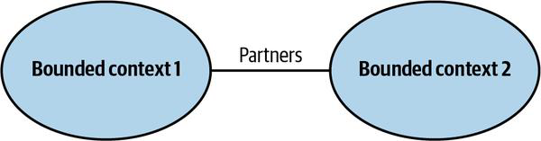 |Beide Teams sind voneinander Abhngig und können nur gemeinsam zum Ziel kommen. <br/> Verwenden i.d.R. CI
|Shared Kernel | 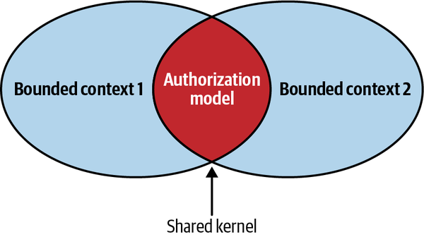|Beteiligte Teams teilen sich einen Teil des Modells | 
|Customer-Supplier | 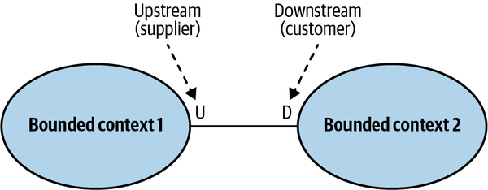 | Ein Team (Customer) ist direkt von einem anderen Team (Supplier) abhängig <br/>Supplier kann auf Bedürfnisse des Customer eingehen<br/> Supplier bestimmt letzendlich was Cusomer erhält (Up-Down-Stream-Verhältnis)
|Conformist| 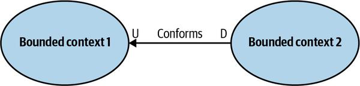 | Spezialfall des Customer-Supplier-Mappings <br/>Customer hat keine Möglichkeit auf Supplier einzuwirken => Übernimmt Module 1zu1
|Anticorruption Layer| 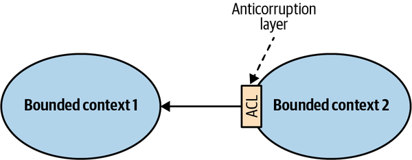 | Defensive Mapping-Art <br/>Downstream-Team baut "Übersetzungsschicht"(Adapter) um Sprache von Upstreamteam in eigene zu übersetzen
|Open Host Service| 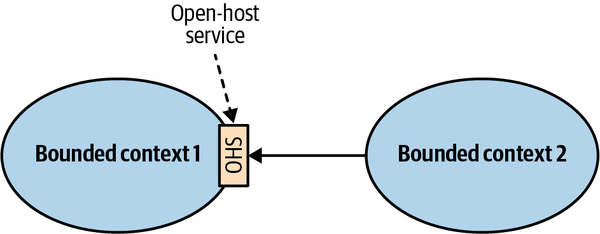 | Customer-Supplier-Mappings <br/>Upstream-Team stellt Schnittstelle(API) bereit, über die Informationen abgerufen werden können <br/> In der heutigen Zeit: OHS = API
|Published Language| 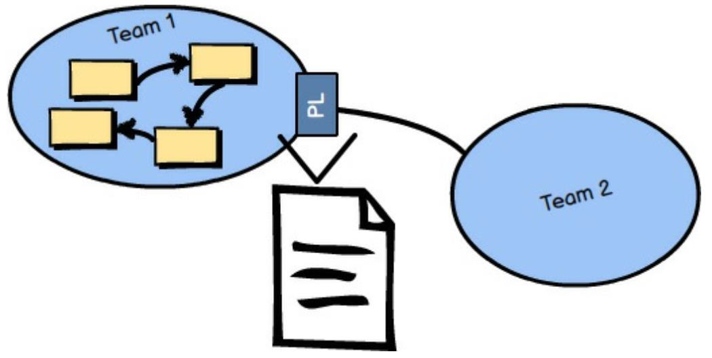 | Spezialisierung OHS <br/> Upstream-Team stellt Schnittstelle zum definierten Dokumentaustausch bereit.
|Seperate Ways| 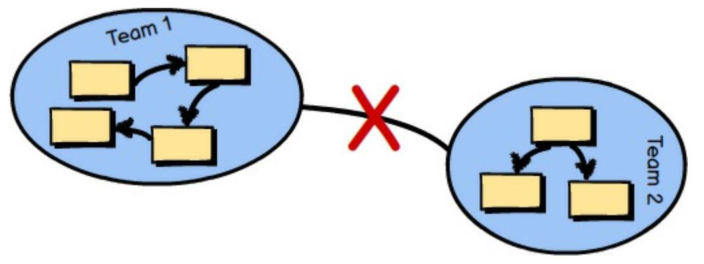 | Jedes Team entwickelt eigene Funktionalität => Häufig nicht rentabel, da viel Code doppelt gebaut werden muss

## Taktisches Design

Das taktische Design beschäftigt sich damit das Innere der Bounded Contexts zu definieren.
Taktisches Design = Wie sieht so ein Bounded Context aus
> Beschäftigt sich mit der Modellierung innerhalb eines Bounded Contexts
=> Entwurf und Aufbau eines Bounded Contexts
- Zentrales Konstrukt: Aggregates
    - Bestandteile: Entities, Value Objects 
- Außerdem
    - Services, Repositories (DBs), Factories

### Aggregats

Ein Agregate besteht aus einem oder mehreren Entities und kann auch Value Objects enthalten
- Entity = Sache, welcher eindeutige ID zugewiesen ist
    - Kann geändert werden
- Value Object = Wert der nicht veränderbar ist
    - Besitzt keine ID
    - Beschreibung einer Sache

Aggregates repräsentieren einen "Zusammenhang", besitzen somit auch Mutationsfunktionalität
- Anemic Aggregates (Bestehen nur aus getter/setter) sollen vermieden werden

Es gelten folgende vier Regeln für den Entwurf von Aggregaten
1. Schütze fachliche Invarianten innerhalb von Aggregat-Grenzen
    - Aufbau eines Aggregates muss aus den Geschäftsregeln abgeleitet sein
2. Aggregate sollten "klein" sein
    - Große Aggregate führen leicht zu Konflikten oder Inkonsistenten
3. Andere Aggregate sollten nur über IDs referenziert werden
    - Alle Aggregate referenzieren das zugehörige Produkt über dessen ID => keine direkten Referenzen!
    - Dadurch soll das unbeabsichtigte Ändern eines Produkts verhindert werden
4. Andere Aggregate werden unter Verwendung von Eventual Consistency geändert
    - **Erinnerung: Eventually Consistent heißt nicht Eventuell Konsistent sondern irgendwann Konsistent**
    - Andere Aggregate werden unter Verwendung von Eventually Consistency geändert

=> CQS-Designprinzip kann helfen

### Command Query Responsibility Segregation (CQS)
Aufteilung des Domänenmodells: Anderungen und Abfragen arbeiten auf zwei verschiedenen Repositorien(DBs)
Queries = Lesende Zugriffe
- Lesen nur aus der Datenbank
Commands = Schreibende Zugriffe
- Das Command löst ein Event aus, welches die Lesedatenbank (irgendwann) aktualisiert


> Dies wird häufig beim Event Sourcing verwendet 

## Collaborative Modeling
 Collaborative Modeling = Anforderungsermittlung, identifiziert Geschäftsprozesse, Rollen und Arbeitsgegenstände im Problemraum
- z.B. Domain Story Telling

## Wichtige Begriffe 
Anticorruptionlayer = Adapter
Open-Host Service = REST-Schnittstelle
PL (Public Language) = JSON oder XML
RPC = Sowas wie RMI oder SOAP
Repository = Datenbank
Value Object = DTO => Datenhalter/Datenobjekte
Entity = Model
Abstraktion = Fachsprache

Invarianten = Schützen vor illegalen Zuständen
>Bsp. Artikel darf erst versendet werden wenn alle Bestellungen verarbeitet wurden => Doppelbuchungen vermeiden.

# Einführung Softwarearchitekturen

Softwarearchitektur hat keine allgemeine Definition

Softwarearchitekt sollte Projekt komplett begleiten

- Analyse von Geschäftsanforderungen
- Festlegung der architektonischen Merkmalen ("Fähigkeiten")
- Auswahl von Architekturmustern und -stilen
- Erstellung von Komponenten (die Bausteine des Systems)

|Architekt | Entwickler |
| --- | --- |
|Architekten sollten ein breites Wissen besitzen | Entwickler sollten ein tiefes Wissen Besitzen |

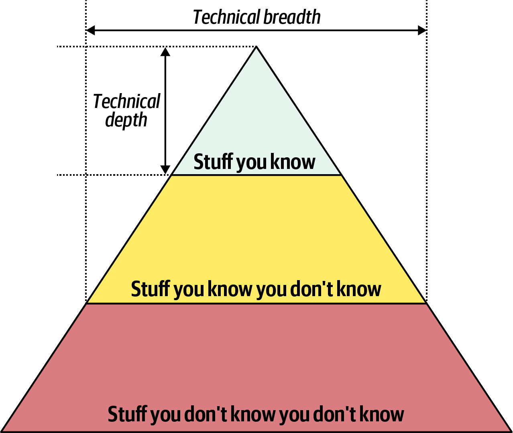

## Qualitätsattribute
Software-Bewertung nach Qualitätsattributen (*itility)


## Definition nach iSAQB
"*Softwarearchitektur definiert die grundlegenden Prinzipien und Regeln für die Organisation eines Systems, dessen Strukturierung in Bausteinen und Schnittstellen sowie deren Beziehungen zueinander wie auch zur Umgebung.*"

Dadurch Richtlinien für den gesamten Systemlebenszyklus.

## Baustein / Software Modul / Software Komponente 
Baustein bietet Schnittstellen an, die er im Sinne eines Vertrages garantiert.

Garantie gilt erst, wenn die benötigten Schnittstellen im Rahmen einer Konfiguration zur Verfügung gestellt werden(Export- und Import-Schnittstellen).

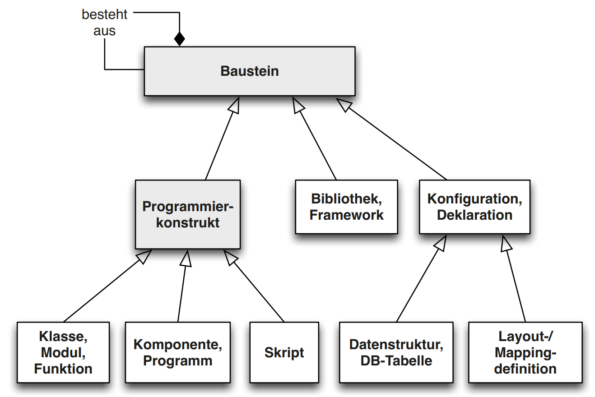

Ein (Super-)Baustein kann aus anderen (Sub-)Bausteinen bestehen und deren Beziehungen implementieren.

### Schnitstellen 

Eine Schnittstelle repräsentiert einen Zugangspunkt zu einem System oder dessen Baustein. Dabei beschreibt die Schnittstelle die Eigenschaften des Zugangspunktes (Attribute, Daten oder Funktionen).

Ziel ist es diese Eigenschaften möglichst präzise mit allen notwendigen Aspekten zu definieren wie z.B.:
- Syntax
- Datenstrukturen
- funktionales Verhalten
- Fehlerverhalten
- nichtfunktionale Eigenschaften
- Nutzungsprotokolle der Schnittstelle
- Technologien
- Randbedingungen
- Semantik

|Komponente und Schnittstellen | Wem gehört die Schnittstelle
| --- | --- |
|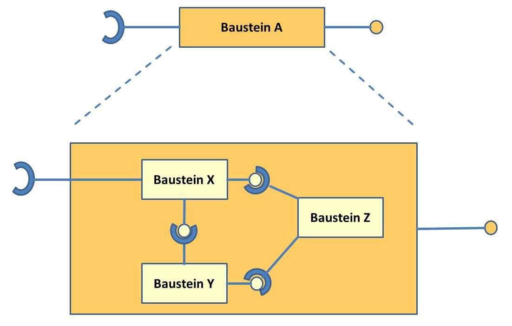|  |

### Modularisierung 
Modularisierung = Zerlegung eines Systems in Teilsysteme (Bausteine)

Ziele
- Beherrschbarkeit von Komplexität
- Bessere Erweiterung und Wartbarkeit
- Bessere Veränderung
- Größere Wiederverwendbarkeit durch Rekombination von Modulen

Modul = Zusammenfassung von Operationen und Daten zur Realisierung einer abgeschlossenen Aufgabe
- Realisiert Geheimnisprinzip (Information Hiding)
- Single-Responsibility-Prinzip

Außenwelt kommuniziert über eindeutig definierte Schnittstelle mit dem Baustein (Exportschnittstelle)
- Exportschnittstelle gibt an, welche Operationen und Daten anderen Module zur Verfügung gestellt werden

Modul/Baustein hängt i.d.R von anderen Modulen ab (Importschnittstelle)
- Importschnittstelle gibt an, welche Operationen und Daten von anderen Modulen benötigt werden

## Entwurf von Softwarearchitekturen

Struktur von Software degeneriert mit der Zeit zu "verfaultem" Design.
Sympthome von "verfaultem" Design:
- Starrheit = Änderungen sind schwierig und führen zu Modifikationen an einer Vielzahl von Komponenten bzw. Klassen
- Zerbrechlichkeit = Änderungen an einer Stelle führen zu Fehlern an ganz anderen Stellen
- Schlechte Wiederverwendbarkeit = Komponenten besitzen viele Abhängigkeiten von Programmteilen, welche im neuen Kontext nicht benötigt werden


### Grundsätze

1. Stakeholder beurteilt Erfolg einer Lösung => Software ist nur gut wenn der Kunde zufrieden ist
2. Einfachheit gewinnt (KISS)
3. Es gibt kein Patentrezept zur Lösung beliebiger Probleme => Wie gut etwas ist wird sich erst mit der Zeit herausstellen
4. Voraussetzungen und Annahmen sollten explizit sein => Wenn etwas für mich klar ist muss es nicht für den Gegenüber klar sein
5. Erwarte Änderungen und Fehler!

### Grundprinzipien

- Strebe nach loser Kopplung
    - Kopplung durch Aufruf (Funktionsaufruf)
    - Kopplung durch Benachrichtigungen (Events o.ä.)
    - Kopplung durch Erzeugung
    - Kopplung durch Daten/Datenstrukturen
    - Kopplung über Zeit
- Strebe nach Kohäsion (Dichte des Bauteils => Zeigt wie gut Baustein ist)
- Trenne Verantwortlichkeiten
- Zerlege Systeme in Module => Modul = in sich geschlossener Baustein
- Nutze Abstraktion, Kapselung und Geheimnisprinzip
- Lösung soll konsistent sein (Nicht 4 verschiedene JSON-Parser sondern einer, welcher Projektweit genutzt wird)
- Vermeide Redundanz (DRY)
- Vermeide Zyklische Abhängigkeiten
> Beachte SOLID

### Wichtige Design-Pattern (für Architektur)
- Adapter
- Observer und MVC
- Decorator
- Proxy
- Fassade
- State
- Mediator (Bsp. API-Gateway/Broker)

## Beschreibung und Kommunikation von Software-Architekturen

| Darstellungsart | Beschreibungsmittel | Inhalt |
| --- | --- | --- |
| Kontextsicht(Kontextabgrenzung)| UML oder Kompositionsdiagramme evtl. Paketdiagramm <br> Listen von Nachbarsystemen und deren Schnittstellen | Inhalt = Beziehungen und Zusammenhänge mit dem Umfeld
|Bausteinsicht |UML-Komponenten und -Paketsymbole evtl. high Level Klassendiagramme|Statische Strukturen eines Softwaresystems <br>Beziehungen zwischen Bausteinen|
|Laufzeitsicht|UML-Aktivitätsdiagramme, -Kommunikationsdiagramme und -Sequenzdiagramme <br>evtl. Flussdiagramme, BPMN-Modelle|Zusammenwirken der Bausteine zur Laufzeit<br>Beziehungen zwischen Bausteinen|
|Verteilungs- und Infrastruktursicht|UML-Deploymentdiagramme<br>evtl. UML-Paket und -Komponentendiagramme|Technische Ablaufumgebung<br>Beziehungen zwischen Bausteinen|

## Bewertung von Softwarearchitekturen

### Qualitative Bewertung

ISO-Normen definieren Softwarequalität anhand von Merkmalen

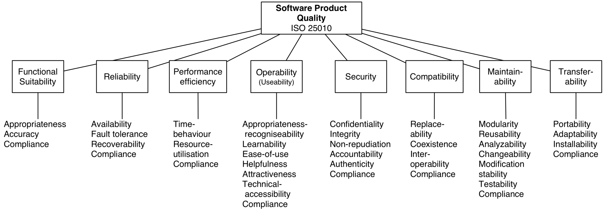

Beispiel für eine Solche Bewertung ist ATAM(Architecture Tradeoff Analysis Method)

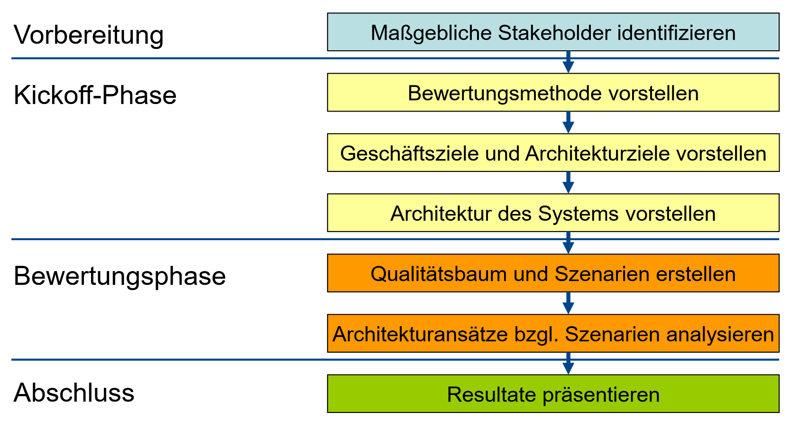

Weitere Verfahren:
- Technicher Durchstich (Klärung technischer Fragen)
- Prototypen
    - Wegwerfprototyp
    - Analyseprototyp (Proof of Concept)
    - Labormuster (Experiment zur Klärung konstruktionsbezogener Fragen)
    - Pilotsystem (Kern des zukünftigen Systems)

### Quantitative Bewertung 

Überprüfung von Architekturregeln und Bewertung anhand von Metriken
- Anforderungen
- Quellcode
- Erstellungsprozess einer Software
- Fehler
- Tests
- Design
- System

# Software Architektur Patterns

Software Architektur Patterns / Stile

Zwei Kathegorien Monolithen(nicht verteilt) und Verteilt

In der Praxis oft Hybridformen


## Monolith versus Verteilt

Verteilte System zeichnen sich aus durch
- Gute Performance
- Gute Skalierungsmöglichkeiten
- Hohe Verfügbarkeit


## Monolithische Architekturen

### Schichtenarchitektur

Fachlichkeit wird nicht beachtet

Trennung nach Technischen Eigenschaften

Fast lanes = Direkter Zugriff über 2 Layer => Macht man aus Performance Gründen (Meistens Fassacde)
=> Machen Schichtenarchitektur kapput

**Meistens angesehen als Antipattern**

Architecture Sinkhole Antipattern (Fast nur noch Delegationen )

Sind gut für:
- Kleine Anwendungen
- Web Anwendungen
- Startpunkt für technische "Proff of Concepts"


### Pipe & Filter - Architektur

Fließband zur Datenverarbeitung

Besteht aus:

- Pipes = Kommunikationskanäle
- Filter = Verarbeitungsprozesse

Bsp. Compiler

Producer = Datenquelle
Transformer = Empfängt Daten, verarbeitet sie und sendet sie Weiter
Consumeer = Endverarbeitung

Ist Datengetrieben 
Bsp. Kafka mit Filtern

### Microkernal

Core System mit Plug-In Componenten

Beispiele: IDEs, Browser, FireFox, Chrome, etc.


## Verteilte Architekturen

### Service Based Architektur

"Microservices für Arme"

Charakteristisch ist eine zentrale Datenbank


Im Grunde einfach Microservices mit einer zentralen Datenbank

Varianten bezüglich des User-Interfaces
- Single Monolithic User Interface
- Domain-Based User Interface
- Service-Based User Interface

Es gibt auch Mischformen
Wenn ein Service bsp. exklusiv Daten verwendet, kann dieser eine eigene DB verwenden

Services können technisch oder anhand der Fachdomäne geschnitten werden

Passt gut zum DDD
Simples Transaktiondesign durch ACID-Eigenschaft der zentralen DB

### Event-Driven Architektur

Orchestrator oder Choreographie

Wird Typischerweise mit REST gemacht (Request Based Model)

Mediator Topologie = Orchestrator


### Space-based Architektur 

Mehrere parallele Prozessoren kommunizieren über einen gemeinsamen Speichert

Beispiel (Ticketverkauf bei Tylor Swift, Auktionshaus)

Client stellt Request an Middleware

### Orchestrierte Serviceorientierte Architektur

WDSL, SOAP wurden hier verwendet

BPMN Prozesse


Konzentriert sich auf Wiederverwendung auf Unternehmensebene

Message Flow


### Microservice Architektur

Treibende Philosophie = Bounded Context

Jeder Service modelliert Domäne oder Workflow

Side-Car-Pattern

Mesh-Frontend = Frontend was aus Bauteilen verschiedener Services bestehen

Auch hier wieder Choreographie und Orchestrierung wichtig!

Häufig SAGAs als Transaktionsmodell (Bei Orchestrierung)


## Auswahl einer Architektur

Entscheidungsmerkmale:
Anwendungsbereiche

Typische Fragestellungen 
- Monolith vs. Verteilt
- Wo liegen die Daten
- Kommunikatonsstil: Synchron vs. Asynchron


<br><br><br><br><br><br><br><br><br><br><br><br><br><br><br><br><br><br><br><br><br><br><br><br><br><br><br><br><br><br><br><br><br><br><br><br><br><br><br><br><br><br><br><br><br><br><br><br><br><br><br><br><br><br><br><br><br><br><br><br><br><br><br><br><br>

# Wahrscheinlich nicht Prüfungsrelevant aber interessant
API-Gateway = Früher. Session Dispatcher => Verteilt API-Anfragen auf die verteilten Backend-Dienste.


Dispatcher oder Gateway => Verantwortlich für die Verteilung der Last auf die verschiedenen Server

## Praktische Begriffe
Resilient = Wiederstandsfähig


[^1]: Fähigkeit, dass Funktionen oder Methoden in verschiedenen Objekten unterschiedlich ausgeführt werden können


